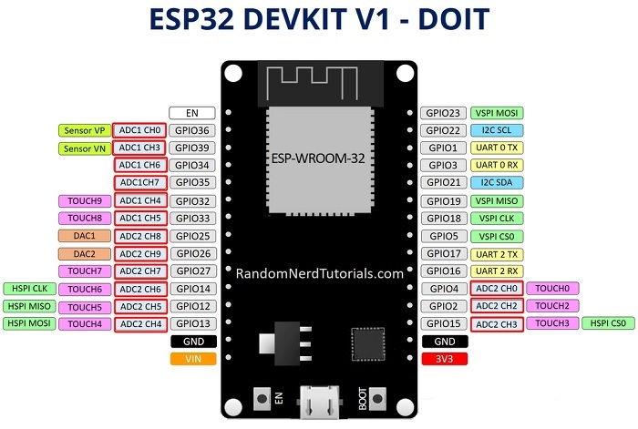

# ESP-WROOM-32S ESP32 Module

## Introduction

The ESP-WROOM-32S development board integrates a variety of peripherals, including capacitive touch sensors, Hall sensors, low noise amplifiers, SD card interface, Ethernet interface, and high-speed SDIO/SPI, UART, I2S, I2C, etc.

This board was purchased from Amazon and branded as ESP-WROOM-32S ESP Board. The ultimate manufacturer is [DOIT](https://www.doit.am/).

Schematics and a bulletin board is available at: [DOIT ESP32 DEVKIT V1](http://bbs.doit.am/forum.php).

Copy of [ESP-WROOM-32S_User_Manual.pdf](ESP-WROOM-32S_User_Manual.pdf)

### Pinout

Pinout diagram specific to the ESP-WROOM-32S ESP32 Module that I have (They can differ!)



*[Source](https://randomnerdtutorials.com/esp32-adc-analog-read-arduino-ide/)*

## Getting it working

### Arduino IDE

1. Connect Arduino to PC/Mac via USB-C cable.
2. Launch Arduino IDE.
3. Open the Blink sketch from main menu bar > File > Examples > 01.Basics > Blink.
4. From the main menu bar, open Tools > Board > Boards Manager.
5. Search for "esp32".
6. Install the version by Espressif Systems.
7. From the main menu bar, open Tools > Boards > esp32 > DOIT ESP32 DEVKIT V1. **NOTE**: *The list is long and not in any kind of order so it can be tricky to find DOIT ESP32 DEVKIT V1.*
8. From the main menu bar, click Sketch > Upload.
9. The code should compile and upload and run on the ESP32.


### Arduino Cloud


### CLion + Platform.io

[Platform.io listing](https://docs.platformio.org/en/latest/boards/espressif32/esp32doit-devkit-v1.html)


#### Platform.io configuration

Please use** `esp32doit-devkit-v1` ID for board option in platformio.ini

```
[env:esp32doit-devkit-v1]
platform = espressif32
board = esp32doit-devkit-v1
```

You can override default DOIT ESP32 DEVKIT V1 settings per build environment using `board_***` option, where `***` is a JSON object path from board manifest esp32doit-devkit-v1.json. For example, board_build.mcu, board_build.f_cpu, etc.

```
[env:esp32doit-devkit-v1]
platform = espressif32
board = esp32doit-devkit-v1

; change microcontroller
board_build.mcu = esp32

; change MCU frequency
board_build.f_cpu = 240000000L
```


## Amazon Listing information

[Amazon listing page](https://www.amazon.com.au/dp/B0DNSNXTG2)


### Description

* **Multiple Functions**: The ESP-WROOM-32 development board integrates a variety of peripherals, including capacitive touch sensors, Hall sensors, low noise amplifiers, SD card interface, Ethernet interface, and high-speed SDIO/SPI, UART, I2S, I2C, etc.
* **High Performance**: The ESP32 HAT features a powerful dual-core CPU, enabling it to deliver exceptional performance for wireless WiFi and Bluetooth connectivity applications.
* **Wireless Connectivity**: With built-in WiFi and Bluetooth capabilities, the ESP32 dual cores microcontroller allows seamless and reliable wireless communication, making it ideal for IoT projects and smart device control.
* **Energy Efficient**: The WiFi + Bluetooth module is designed to be highly energy efficient, ensuring long battery life and reducing power consumption, making it suitable for low-power applications and portable devices.
* **Easy Integration**: The ESP-32S board is compatible with a wide range of development platforms and programming languages, facilitating easy integration into existing projects and reducing development time.

### Technical Details


| Brand                    | ‎DIGISHUO                              |
| ------------------------ | --------------------------------------- |
| Manufacturer             | ‎DIGISHUO                              |
| Model                    | ‎2Pcs ESP-WROOM-32 Type C              |
| Part Number              | ‎A158A                                 |
| Ram Memory Technology    | ‎LPDDR4                                |
| Operating System         | ‎FreeRTOS                              |
| Processor Brand          | ‎Espressif                             |
| Processor Count          | ‎2                                     |
| Compatible Devices       | ‎Arduino IDE, Various external devices |
| Mounting Hardware        | ‎Esp8266 Module                        |
| Number of items          | ‎2                                     |
| Voltage                  | ‎5 Volts                               |
| Batteries Required       | ‎No                                    |
| Wireless Type            | ‎802.11n                               |
| Total USB ports          | ‎1                                     |
| Connector Type           | ‎Bluetooth, Wi-Fi                      |
| Package Dimensions       | ‎10.2 x 9.9 x 2.2 cm; 30 Grams         |
| Item Weight              | ‎30 g                                  |
| Manufacturer             | ‎DIGISHUO                              |
| ASIN                     | ‎B0DNSNXTG2                            |
| Country/Region of origin | ‎China                                 |
| Item Model Number        | ‎2Pcs ESP-WROOM-32 Type C              |
| Date First Available     | ‎30 May 2021                           |

### Product Notes ([from Amazon seller](https://www.amazon.com.au/dp/B0DNSNXTG2?th=1))

**Note:Some of the chips have a bios that does not allow the flash mode 'QIO'. Changing it to 'QOUT' fixed it for all of them.**

* ESP32 is already integrated antenna and RF balun, power amplifier, low-noise amplifiers, filters, and power management module.
* The entire solution takes up the least amount of printed circuit board area
* This board is used with 2.4 GHz dual-mode Wi-Fi and Bluetooth chips by TSMC 40nm low power technology, power and RF properties best, which is safe, reliable, and scalable to a variety of applications
* High performance-price ratio Small volume
* Easily embeded to other products Strong function with support LWIP protocol
* Free rtos Supporting three modes: AP, STA, and AP+STA Supporting Lua program, easily to develop

**You'll Receive**

2Pcs ESP-WROOM-32 2.4GHz WiFi Bluetooth Development Board.
