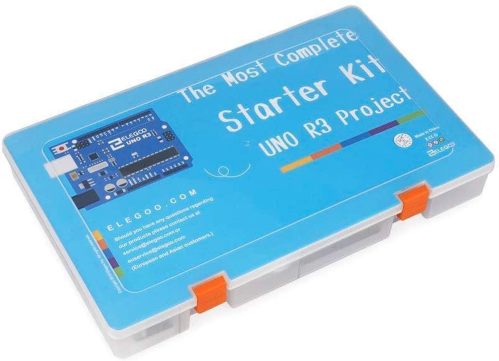
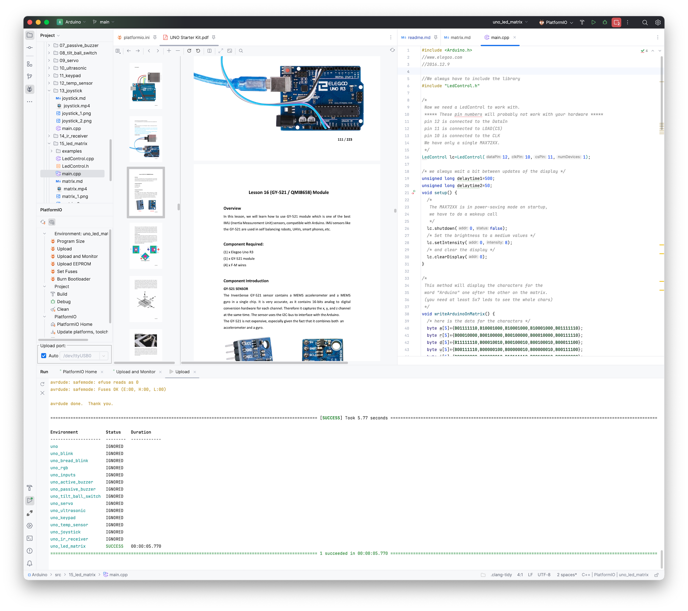
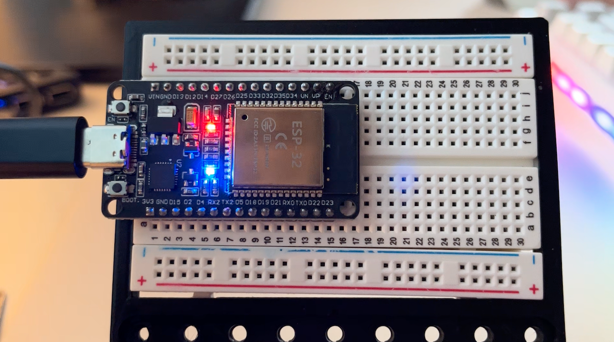

# Arduino Starter Kit

This is a copy of my practice at each of the lessons in the [Elegoo UNO R3 Most Complete Starter Kit](https://us.elegoo.com/products/elegoo-uno-most-complete-starter-kit?srsltid=AfmBOopwmmRRFqXMA8s_49O7t6PzQc1Nwn5HTS4Kw9S1tRvhyw10xpbw).

This is a really well made kit, with easy to follow, clear instructions and quality components.

I wasn't a fan of the [Ardiuno IDE](https://www.arduino.cc/en/software/), becuase it seems very single minded about having a new window for every [sketch](https://docs.arduino.cc/learn/programming/sketches/), which gets crazy when working through the 25 tutorials that come with this kit, so I've included some notes about using [Intellij CLion](https://www.jetbrains.com/clion/) and the [Platform.io](https://platformio.org) plugin to build the modify the code for each lesson.

Most of the text in the lessons is copy/pasted from the [Uno Starter Kit.pdf](docs/UNO%20Starter%20Kit.pdf), with a little bit of formatting or extra comments where I got stuck.

## Lessons

* Lesson 1 - Blink
* [Lesson 3 - Blink from LED on Breadboard](src/03_bread_blink/)
* [Lesson 4 - RGB LED](src/04_rgb_led/)
* [Lesson 5 - Digital Inputs using push buttons](src/05_digital_inputs/)
* [Lesson 6 - Active Buzzer](src/06_active_buzzer/)
* [Lesson 7 - Passive Buzzer](src/07_passive_buzzer/)
* [Lesson 8 - Tilt Ball Switch](src/08_tilt_ball_switch/)
* [Lesson 9 - Servo](src/09_servo/)
* [Lesson 10 - Ultrasonic Sensor](src/10_ultrasonic/)
* [Lesson 11 - Keypad Membrane Switch](src/11_keypad/)
* [Lesson 12 - Temperature and Humidity Sensor](src/12_temp_sensor/)
* [Lesson 13 - Joystick](src/13_joystick/)
* [Lesson 14 - IR Receiver](src/14_ir_receiver/)
* [Lesson 15 - MAX7219 LED Dot Matrix Module](src/15_led_matrix/)
* [Lesson 16 - MPU6050 Accelerometer and Gyroscope Module](src/16_gyroscope/)
* [Lesson 17 - HC-SR501 PIR Sensor](src/17_pir_sensor/)
* [Lesson 18 - Water level detection module](src/18_water_level/)
* [Lesson 19 - Realtime Clock](src/19_clock/)
* [Lesson 20 - Sound Sensor Module](src/20_sound_sensor/)

## Arduino Boards

### Elegoo Uno R3

This is the board that comes with the [Elegoo UNO R3 Most Complete Starter Kit](https://us.elegoo.com/products/elegoo-uno-most-complete-starter-kit?srsltid=AfmBOopwmmRRFqXMA8s_49O7t6PzQc1Nwn5HTS4Kw9S1tRvhyw10xpbw).

### ESP-WROOM-32 ESP32

This board integrates a variety of peripherals, including [capacitive touch sensors](https://www.youtube.com/watch?v=4YY7TutRrQE), [Hall sensors](https://www.youtube.com/watch?v=vyDZdwk76Jk), low noise amplifiers, [SD card interface](https://www.youtube.com/watch?v=e1xOgZsnAuw), [Ethernet interface](https://www.youtube.com/watch?v=_C8r7ypEB7k), and high-speed SDIO/SPI, UART, I2S, I2C, etc.

[General Setup instructions](esp32/) and [Wi-Fi connection instructions](esp32/wifi.md)

### Arduino Cloud
