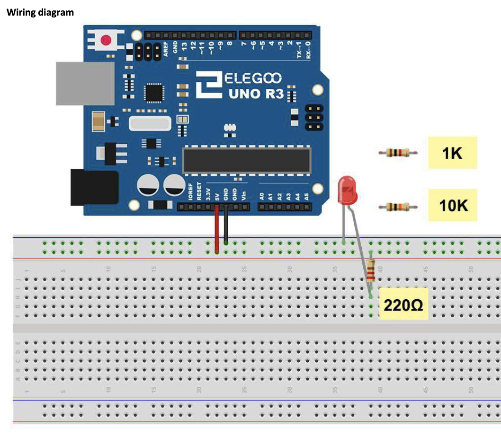

# Blink

## Elegoo Lesson 3

[Uno Starter Kit.pdf > Page 43](../../docs/UNO%20Starter%20Kit.pdf)

### Overview

The UNO is a convenient source of 5 volts, which we will use to provide power to
the LED and the resistor.

You do not need to do anything with your UNO, except to
plug it into a USB cable.

With the 220 Ω resistor in place, the LED should be quite bright. If you swap out the
220 Ω resistor for the 1kΩ resistor, then the LED will appear a little dimmer. Finally,
with the 10 kΩ resistor in place, the LED will be just about visible.

Pull the red jumper
lead out of the breadboard and touch it into the hole and remove it, so that it acts
like a switch. You should just be able to notice the difference.

At the moment, you have 5V going to one leg of the resistor, the other leg of the
resistor going to the positive side of the LED and the other side of the LED going to
GND. However, if we moved the resistor so that it came after the LED, as shown
below, the LED will still light.

You will probably want to put the 220Ω resistor back in place.
It does not matter which side of the LED we put the resistor, as long as it is there
somewhere

