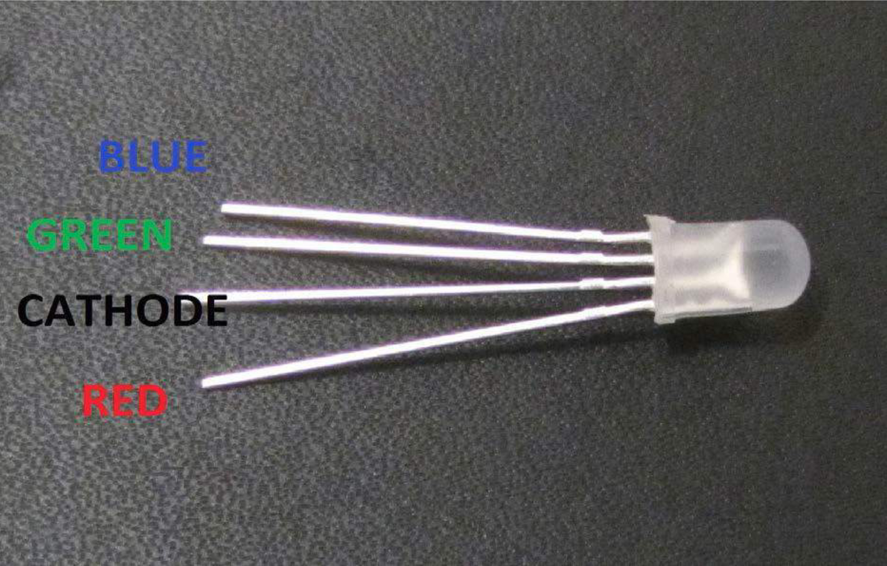
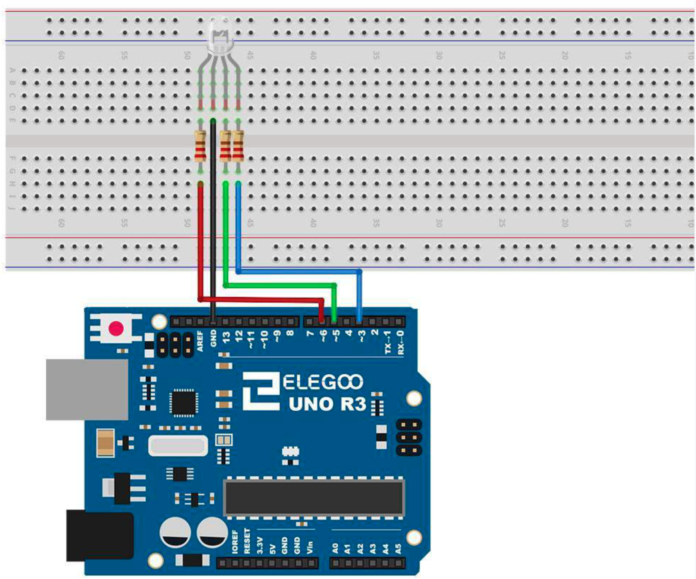

# RGB LED

## Elegoo Lesson 4

[Uno Starter Kit.pdf > Page 5](../../docs/UNO%20Starter%20Kit.pdf)

### Overview

RGB LEDs are a fun and easy way to add some color to your projects. Since they are
like 3 regular LEDs in one, how to use and connect them is not much different.
They come mostly in 2 versions: Common Anode or Common Cathode.
Common Anode uses 5V on the common pin, while Common Cathode connects to
ground.

As with any LED, we need to connect some resistors inline (3 total) so we can limit
the current being drawn.

In our sketch, we will start with the LED in the Red color state, then fade to Green,
then fade to Blue and finally back to the Red color. By doing this we will cycle
through most of the color that can be achieved.

**Components Required:**

* (1) x Elegoo Uno R3
* (1) x 830 Tie Points Breadboard
* (4) x M-M wires (Male to Male jumper wires)
* (1) x RGB LED
* (3) x 220 ohm resistors

### Component Introduction

RGB:
At first glance, RGB (Red, Green and Blue) LEDs look just like regular LEDs. However,
inside the usual LED package, there are actually three LEDs, one red, one green and
yes, one blue. By controlling the brightness of each of the individual LEDs you can
mix pretty much any color you want.

We mix colors the same way you would mix paint on a palette - by adjusting the
brightness of each of the three LEDs. The hard way to do this would be to use
different value resistors (or variable resistors) as we did with in Lesson 2, but that's
a lot of work! Fortunately for us, UNO R3 board has an analogWrite function that
you can use with pins marked with a ~ to output a variable amount of power to the
appropriate LEDs.

The RGB LED has four leads. There is one lead going to the positive connection of
each of the single LEDs within the package and a single lead that is connected to all
three negative sides of the LEDs.

Here on the photographs you can see 4 electrode LED. Every separate pin for Green
or Blue or Red color is called Anode. You will always connect “+” to it.

Cathode goes to “-“(ground). If you connect it other way round the LED will not light.
The common negative connection of the LED package is the second pin from the flat
side.

It is also the longest of the four leads and will be connected to the ground.

Each LED inside the package requires its own 220Ω resistor to prevent too much
current flowing through it. The three positive leads of the LEDs (one red, one green
and one blue) are connected to UNO output pins using these resistors.

### Wiring Diagram

