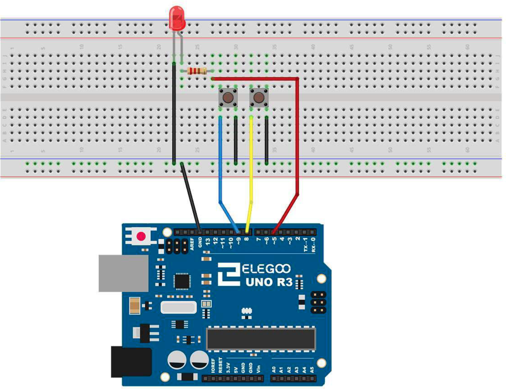
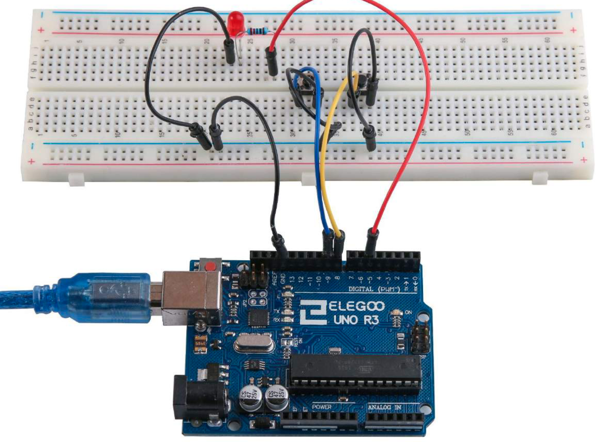

# Digital Inputs

## Lesson 5

### Overview

In this lesson, you will learn to use push buttons with digital inputs to turn an LED on and off.

Pressing the button will turn the LED on; pressing the other button will turn the LED off.

**Component Required:**
(1) x Elegoo Uno R3
(1) x 830 Tie-points Breadboard
(1) x 5mm red LED
(1) x 220 ohm resistor
(2) x push switches
(7) x M-M wires (Male to Male jumper wires)

**Component Introduction**

**PUSH SWITCHES:**

Switches are really simple components. When you press a button or flip a lever, they connect two contacts together so that electricity can flow through them.

The little tactile switches that are used in this lesson have four connections, which can be a little confusing


> Actually, there are only really two electrical connections. Inside the switch package, pins B and C are connected together, as are A and D.

### Wiring Diagram



Although the bodies of the switches are square, the pins protrude from opposite
sides of the switch.

This means that the pins will only be far enough apart when they are placed correctly on the breadboard.

Remember that the LED has to have the shorter negative lead to the left.

### Code

After wiring，please open program in the code folder - Lesson 5 Digital Inputs, and press UPLOAD to upload the program.

If errors are prompted, see Lesson 2 for details about the tutorial on program upload.

Load the sketch onto your UNO board. Pressing the left button will turn the LED on while pressing the right button will turn it off.

The first part of the sketch defines three variables for the three pins that are to be used.

The `ledPin` is the output pin and `buttonApin` will refer to the switch nearer
the top of the breadboard and 'buttonBpin' to the other switch.

The `setup` function defines the ledPin as being an OUTPUT as normal, but now we
have the two inputs to deal with. In this case, we use the set the pinMode to be
`INPUT_PULLUP` like this:

```
pinMode(buttonApin, INPUT_PULLUP);
pinMode(buttonBpin, INPUT_PULLUP);
```

The pin mode of INPUT_PULLUP means that the pin is to be used as an input, but
that if nothing else is connected to the input, it should be 'pulled up' to HIGH.

In other words, the default value for the input is HIGH, unless it is pulled LOW by the action of pressing the button.

This is why the switches are connected to GND. When a switch is pressed, it
connects the input pin to GND, so that it is no longer HIGH.

Since the input is normally HIGH and only goes LOW when the button is pressed, the logic is a little upside down. We will handle this in the 'loop' function.

```
void loop()
{
    if (digitalRead(buttonApin) == LOW)
    {
        digitalWrite(ledPin, HIGH);
     }
     if (digitalRead(buttonBpin) == LOW)
     {
         digitalWrite(ledPin, LOW);
     }
}
```

In the 'loop' function there are two 'if' statements. One for each button. Each does an 'digitalRead' on the appropriate input.

Remember that if the button is pressed, the corresponding input will be LOW, if
button A is low, then a 'digitalWrite' on the ledPin turns it on.

Similarly, if button B is pressed, a LOW is written to the ledPin.



## Result


