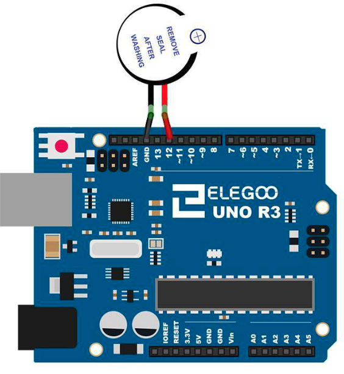

# Active Buzzer

## Elegoo Lesson 6

[Uno Starter Kit.pdf > Page 64](../../docs/UNO%20Starter%20Kit.pdf)

### Overview

In this lesson, you will learn how to generate a sound with an active buzzer.

**Components Required:**

* (1) x Elegoo Uno R3
* (1) x Active buzzer
* (2) x F-M wires (Female to Male DuPont wires)

### Component Introduction

Electronic buzzers are DC-powered and equipped with an integrated circuit.

They are widely used in computers, printers, photocopiers, alarms, electronic toys, automotive electronic devices, telephones, timers and other electronic products for
voice devices.

Buzzers can be categorized as active and passive ones.

Turn the pins of two buzzers face up. The one with a green circuit board is a passive buzzer, while the other enclosed with a black tape is an active one.

The difference between the two is that an active buzzer has a built-in oscillating  source, so it will generate a sound when electrified.

A passive buzzer does not have such a source so it will not tweet if DC signals are used; instead, you need to use square waves whose frequency is between 2K and 5K to drive it.

The active buzzer is often more expensive than the passive one because of multiple built-in oscillating
circuits.

### Wiring Diagram

After wiring, please open the program in the code folder:

* Lesson 6 Making Sounds

and click UPLOAD to upload the program. See Lesson 2 for details about program uploading if there are any errors.

## Result

