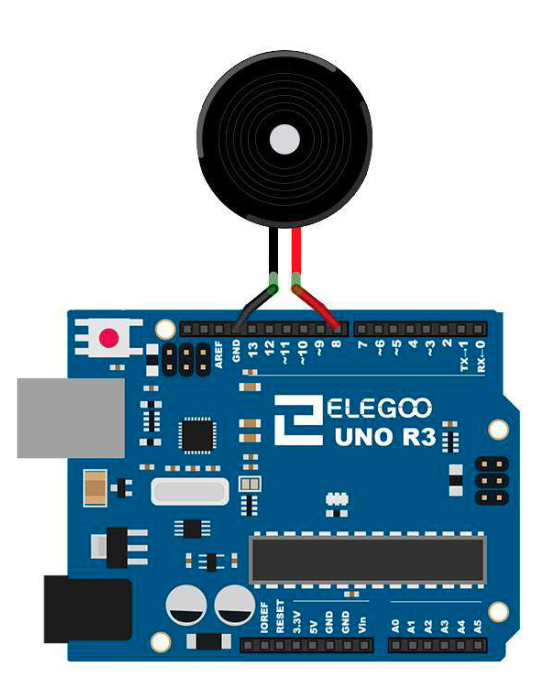

# Passive Buzzer

## Elegoo Lesson 7

[Uno Starter Kit.pdf > Page 68](../../docs/UNO%20Starter%20Kit.pdf)

### Overview

In this lesson, you will learn how to use a passive buzzer.
The purpose of the experiment is to generate eight different sounds, each sound lasting 0.5 seconds: from Alto Do (523Hz), Re (587Hz), Mi (659Hz), Fa (698Hz), So (784Hz), La (880Hz), Si (988Hz) to Treble Do (1047Hz).

**Components Required:**

* (1) x Elegoo Uno R3
* (1) x Passive buzzer
* (2) x F-M wires (Female to Male DuPont wires)

### Component Introduction

The working principle of passive buzzer is using PWM generating audio to make the air to vibrate.

Appropriately changed as long as the vibration frequency, it can generate different sounds.

For example, sending a pulse of 523Hz, it can generate Alto Do, pulse of 587Hz, it can generate midrange Re, pulse of 659Hz, it can produce midrange Mi. By the buzzer, you can play a song.

We should be careful not to use the UNO R3 board analog Write () function to generate a pulse to the buzzer, because the pulse output of analog Write () is fixed (500Hz).

### Wiring Diagram

Wiring the buzzer connected to the UNO R3 board, the red (positive) to the pin8, black wire (negative) to the GND

### Code

After wiring, please open the program in the code folder- Lesson 7 Passive Buzzer and
click UPLOAD to upload the program. See Lesson 2 for details about program
uploading if there are any errors.
Before you can run this, make sure that you have installed the <pitches> library or
re-install it, if necessary. Otherwise, your code won't work.
For details about loading the library file, see Lesson 1.

## Result

