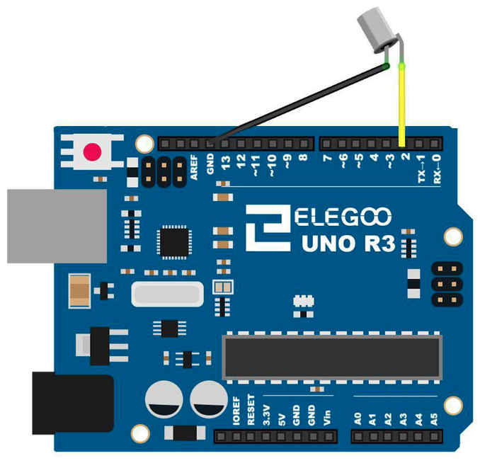

# Tilt Ball Switch

## Elegoo Lesson 8

[Uno Starter Kit.pdf > Page 72](../../docs/UNO%20Starter%20Kit.pdf)

### Overview

In this lesson, you will learn how to use a tilt ball switch in order to detect small angle of inclination.

**Components Required:**

* (1) x Elegoo Uno R3
* (1) x Tilt Ball switch
* (2) x F-M wires (Female to Male DuPont wires)

### Component Introduction

Tilt sensors (tilt ball switch) allow you to detect orientation or inclination. They are small, inexpensive, low-power and easy-to-use. If used properly, they will not wear out.

Their simplicity makes them popular for toys, gadgets and appliances.

Sometimes, they are referred to as "mercury switches", "tilt switches" or "rolling ball sensors" for obvious reasons.

They are usually made up of a cavity of some sort (cylindrical is popular, although not always) with a conductive free mass inside, such as a blob of mercury or rolling ball. One end of the cavity has two conductive elements (poles). When the sensor is oriented so that that end is downwards, the mass rolls onto the poles and shorts them, acting as a switch throw.

While not as precise or flexible as a full accelerometer, tilt switches can detect motion or orientation. Another benefit is that the big ones can switch power on their own.

Accelerometers, on the other hand, output digital or analog voltage that must then be analyzed using extra circuitry.

### Wiring Diagram

Wiring the buzzer connected to the UNO R3 board, the red (positive) to the pin8, black wire (negative) to the GND

### Code

After wiring, please open the program in the code folder - Lesson 8 Ball Switch and click UPLOAD to upload the program. See Lesson 2 for details about program uploading if there are any errors.

## Result

https://github.com/user-attachments/assets/324ba31e-3f29-484d-9ea1-80f1463f8999
