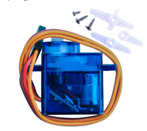
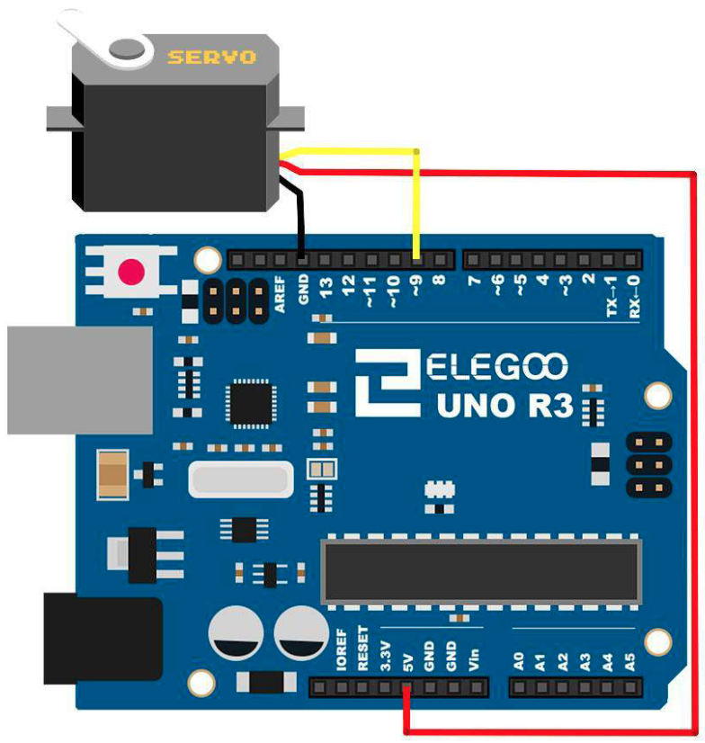

# Servo

## Elegoo Lesson 9

[Uno Starter Kit.pdf > Page 76](../../docs/UNO%20Starter%20Kit.pdf)

### Overview

Servo is a type of geared motor that can only rotate 180 degrees.

It is controlled by sending electrical pulses from your UNO R3 board. These pulses tell the servo what position it should move to.

The Servo has three wires, of which the **brown** one is the
ground wire and should be connected to the **GND** port of UNO, the  **red** one is the power wire and should be connected to the **5v** port, and the **orange** one is the signal wire and should be connected to the **Dig #9** port.

**Components Required:**

* (1) x Elegoo Uno R3
* (1) x Servo (SG90)
* (3) x M-M wires (Male to Male jumper wires)

**Component Introduction**

* Universal for JR and FP connector
* Cable length : 25cm
* No load; Operating speed: 0.12 sec / 60 degree (4.8V), 0.10 sec / 60 degree (6.0V)
* Stall torque (4.8V): 1.6kg/cm
* Temperature : -30 ~ 60C
* Dead band width: 5us
* Working voltage: 3.5~6V
* Dimension : 1.26 in x 1.18 in x 0.47 in (3.2 cm x 3 cm x 1.2 cm)
* Weight : 4.73 oz (134 g)

### Wiring Diagram

In the picture, the brown wire of servo is adapted via the black M-M wires, the red one is adapted via the red M-M wires, and the orange one is adapted via the yellow M-M wires.

### Code

After wiring, please open the program in the code folder- Lesson 9 Servo and click UPLOAD to upload the program. See Lesson 2 for details about program uploading if there are any errors.

Before you can run this, make sure that you have installed the < Servo> library or re-install it, if necessary. Otherwise, your code won't work.

For details about loading the library file, see Lesson 1

## Result

