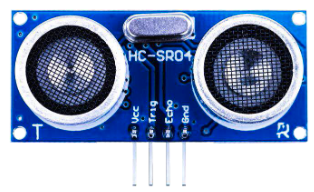
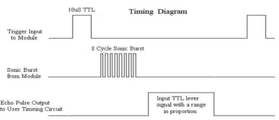
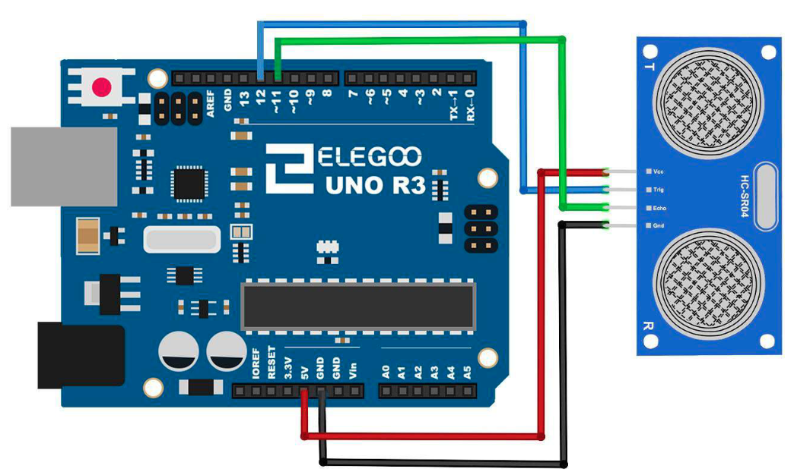

# Ultrasonic Sensor Module

## Elegoo Lesson 10

[Uno Starter Kit.pdf > Page 80](../../docs/UNO%20Starter%20Kit.pdf)

### Overview

Ultrasonic sensor is great for all kind of projects that need distance measurements, avoiding obstacles as examples.

The HC-SR04 is inexpensive and easy to use since we will be using a Library specifically designed for these sensor.

**Components Required:**

* (1) x Elegoo Uno R3
* (1) x Ultrasonic sensor module
* (4) x F-M wires (Female to Male DuPont wires)

**Component Introduction**

Ultrasonic sensor module HC-SR04 provides 2cm-400cm non-contact measurement function, the ranging accuracy can reach to 3mm. The modules includes ultrasonic transmitters, receiver and control circuit.

The basic principle of work:

1. Using IO trigger for at least 10us high level signal,
2. The Module automatically sends eight 40 kHz and detect whether there is a pulse signal back.
3. IF the signal back, through high level , time of high output IO duration is the time from sending ultrasonic tore turning.

Test distance = (high level time × velocity of sound (340m/s) /2

The Timing diagram is shown below.

You only need to supply a short 10us pulse to the trigger input to start the ranging, and then the module will send out an 8 cycle burst of ultrasound at 40 kHz and raise its echo. The Echo is a distance object that is pulse width and the range in proportion.

You can calculate the range through the time interval between sending trigger signal and receiving echo signal.

Formula:

us / 58 = centimeters or us / 148 =inch; or:

the range = high level time * velocity (340M/S) / 2;

we suggest to use over 60ms measurement cycle, in order to prevent trigger signal to the echo signal.

### Wiring Diagram

### Code

Using a Library designed for these sensors will make our code short and simple.

We include the library at the beginning of our code, and then by using simple
commands we can control the behavior of the sensor.

After wiring, please open the program in the code folder- Lesson 10 Ultrasonic Sensor
Module and click UPLOAD to upload the program.

See Lesson 2 for details about program uploading if there are any errors.

Before you can run this, make sure that you have **installed the < HC-SR04> library** or
re-install it, if necessary. Otherwise, your code won't work.

### Installing the library via CLion and Platform.io

1. Make a copy of the `platformio.ini` file because the procedure is gonna delete any comments or formatting you might have.
2. Open the Platform.io panel
3. Click the PlatformIO Home menu option.
4. Open [127.0.0.1:8008](http://127.0.0.1:8008)
5. Login. Details are in 1Password.
6. Search for **HC-SR04 by Martin Sosic** Library and add it to the project
7. Copy the sample code to  this lesson folder.
8. Unzip, and tidy up any files.
9. Upload and monitor.

## Result

