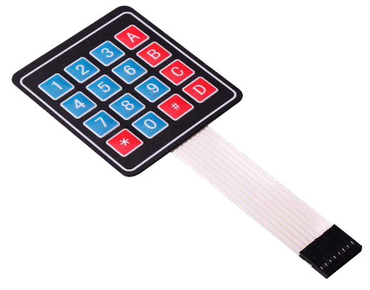
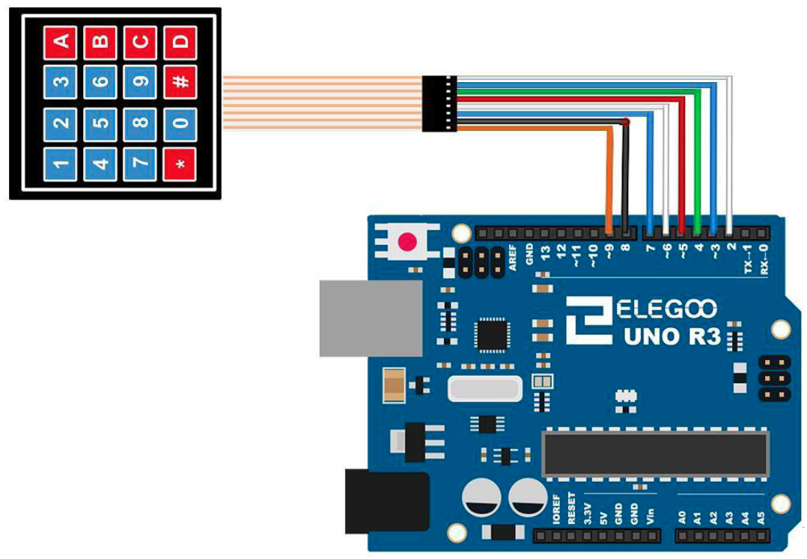

# Membrane Keypad Switch

## Elegoo Lesson 11

[Uno Starter Kit.pdf > Page 85](../../docs/UNO%20Starter%20Kit.pdf)

### Overview

In this project, we will go over how to integrate a keyboard with an UNO R3 board so that the UNO R3 can read the keys being pressed by a user.

Keypads are used in all types of devices, including cell phones, fax machines, microwaves, ovens, door locks, etc. They're practically everywhere. Tons of electronic devices use them for user input.

So knowing how to connect a keypad to a microcontroller such as an UNO R3 board is very valuable for building many different types of commercial products.

At the end when all is connected properly and programmed, when a key is pressed, it shows up at the Serial Monitor on your computer. Whenever you press a key, it shows up on the Serial Monitor. For simplicity purposes, we start at simply showing the key pressed on the computer.

For this project, the type of keypad we will use is a matrix keypad. This is a keypad that follows an encoding scheme that allows it to have much less output pins than there are keys. For example, the matrix keypad we are using has 16 keys (0-9, A-D,*, #), yet only 8 output pins.

With a linear keypad, there would have to be 17 output pins (one for each key and a ground pin) in order to work.

The matrix encoding scheme allows for less output pins and thus much less connections that have to make for the keypad to work.

In this way, they are more efficient than linear keypads, being that they have less wiring.

**Components Required:**

* (1) x Elegoo Uno R3
* (1) x Membrane switch module
* (8) x M-M wires (Male to Male jumper wires)

**Component Introduction**

### Wiring Diagram

When connecting the pins to the UNO R3 board, we connect them to the digital output pins, D9-D2.

We connect the first pin of the keypad to D9, the second pin to D8, the third pin to D7, the fourth pin to D6, the fifth pin to D5, the sixth pin to D4, the seventh pin to D3, and the eighth pin to D2.

These are the connections in a table:

| Keypad Pin | Connects to Arduino Pin... |
| ---------- | -------------------------- |
| 1          | D9                         |
| 2          | D8                         |
| 3          | D7                         |
| 4          | D6                         |
| 5          | D5                         |
| 6          | D4                         |
| 7          | D3                         |
| 8          | D2                         |

### Code

After wiring, please open the program in the code folder- Lesson 11 Membrane Switch Module and click UPLOAD to upload the program.

See [Lesson 2](../) for details about program uploading if there are any errors.

Before you can run this, make sure that you have installed the `<Keypad>` library or re-install it, if necessary. Otherwise, your code won't work

### Installing the library via CLion and Platform.io

1. Make a copy of the `platformio.ini` file because the procedure is gonna delete any comments or formatting you might have.
2. Open the Platform.io panel
3. Click the **PlatformIO Home** menu option.
4. Open [127.0.0.1:8008](http://127.0.0.1:8008)
5. Login. Details are in Password Manager.
6. Search for **Keypad by Mark Stanley and Alexander Brevig** Library and add it to the project
7. Copy the sample code to  this lesson folder.
8. Unzip, and tidy up any files.
9. Upload and monitor.

## Result

https://github.com/user-attachments/assets/935ee846-a057-44ff-b01c-d87b8704ba86
