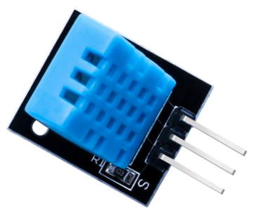
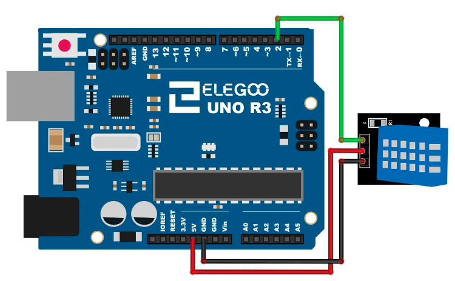

# DHT11 Temperature and Humidity Sensor

## Elegoo Lesson 12

[Uno Starter Kit.pdf > Page 91](../../docs/UNO%20Starter%20Kit.pdf)

### Overview

In this tutorial we will learn how to use a DHT11 Temperature and Humidity Sensor.

It’s accurate enough for most projects that need to keep track of humidity and temperature readings.

Again we will be using a Library specifically designed for these sensors that will make our code short and easy to write.

**Components Required:**

* (1) x Elegoo Uno R3
* (1) x DHT11 Temperature and Humidity module
* (3) x F-M wires (Female to Male DuPont wires)

**Component Introduction**

DHT11 digital temperature and humidity sensor is a composite Sensor which contains a calibrated digital signal output of the temperature and humidity.

The dedicated digital modules collection technology and the temperature and humidity sensing technology are applied to ensure that the product has high reliability and excellent long-term stability.

The sensor includes a resistive sense of wet components and a NTC temperature measurement devices, and connects with a high-performance 8-bit microcontroller.

Applications: HVAC, dehumidifier, testing and inspection equipment, consumer goods, automotive, automatic control, data loggers, weather stations, home appliances, humidity regulator, medical and other humidity measurement and control

### Product parameters

* Relative humidity:

  * Resolution: 16Bit
    Repeatability: ±1% RH
    Accuracy: At 25℃ ±5% RH
* Interchangeability: fully interchangeable
* Response time:

  * 1 / e (63%) of 25℃ 6s
  * 1m / s air 6s
* Hysteresis: <± 0.3% RH
* Long-term stability: <± 0.5% RH / yr in
* Temperature:

  * Resolution: 16Bit
  * Repeatability: ±0.2℃
  * Range: At 25℃ ±2℃
  * Response time: 1 / e (63%) 10S
* Electrical Characteristics

  * Power supply: DC 3.5～5.5V
  * Supply Current: measurement 0.3mA standby 60μA
  * Sampling period: more than 2 seconds

#### Pin Description:

1. the VDD power supply 3.5～5.5V DC
2. DATA serial data, a single bus
3. NC, empty pin
4. GND ground, the negative power

### Wiring Diagram

As you can see we only need 3 connections to the sensor, since one of the pin is not used.
The connections are: Voltage, Ground and Signal which can be connected to any Pin on our UNO

### Code

After wiring, please open the program in the code folder- Lesson 12 DHT11 Temperature and Humidity Sensor and click UPLOAD to upload the program.

See Lesson 2 for details about program uploading if there are any errors.

Before you can run this, make sure that you have installed the `<SimpleDHT>` library by Winlin.

### Installing the library via CLion and Platform.io

1. Make a copy of the `platformio.ini` file because the procedure is gonna delete any comments or formatting you might have.
2. Open the Platform.io panel
3. Click the **PlatformIO Home** menu option.
4. Open [127.0.0.1:8008](http://127.0.0.1:8008)
5. Login. Details are in Password Manager.
6. Search for **SimpleDHT by Winlin** and add it to the project
7. Copy the sample code to  this lesson folder.
8. Unzip, and tidy up any files.
9. Upload and monitor.

## Result

