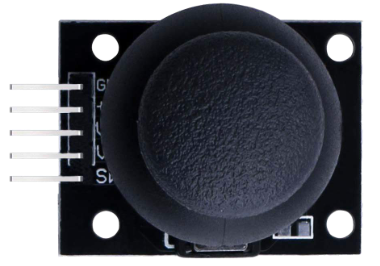
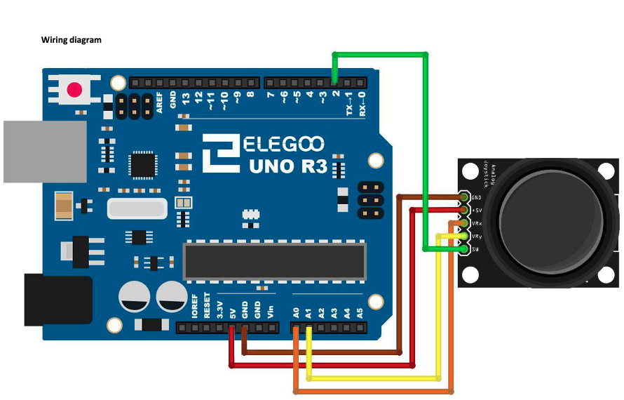

# Analog Joystick Module

## Elegoo Lesson 13

[Uno Starter Kit.pdf > Page 97](../../docs/UNO%20Starter%20Kit.pdf)

### Overview

Analog joysticks are a great way to add some control in your projects.

In this tutorial we will learn how to use the analog joystick module

**Components Required:**

* (1) x Elegoo Uno R3
* (1) x Joystick module
* (5) x F-M wires (Female to Male DuPont wires)

**Component Introduction**

The module has 5 pins: VCC, Ground, X, Y, Key. Note that the labels on yours may be slightly different, depending on where you got the module from.

The thumb stick is analog and should provide more accurate readings than simple ‘directional’ joysticks tact use some forms of buttons, or mechanical switches.

Additionally, you can press the joystick down (rather hard on mine) to activate a ‘press to select’ push-button.

We have to use analog Arduino pins to read the data from the X/Y pins, and a digital pin to read the button.

The Key pin is connected to ground, when the joystick is pressed down, and is floating otherwise. To get stable readings from the Key/Select pin, it needs to be connected to VCC via a pull-up resistor.

The built in resistors on the Arduino digital pins can be used.

For a tutorial on how to activate the pull-up resistors for Arduino pins, configured as inputs see ... what??

### Wiring Diagram

We need 5 connections to the joystick.

The connections are: Key, Y, X, Voltage and Ground.

“Y and X” are Analog and “Key” is Digital.

If you don’t need the switch then you can use only 4 pins

### Code

After wiring, please open the program in the code folder - Lesson 13 Analog Joystick Module and click UPLOAD to upload the program.

Analog joysticks are basically potentiometers so they return analog values. When the joystick is in the resting position or middle, it should return a value of about 512.

The range of values goes from 0 to 1024

## Result

