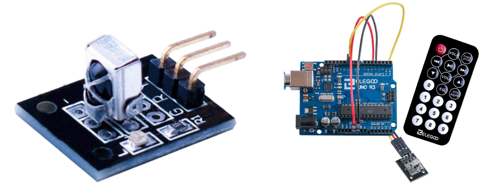
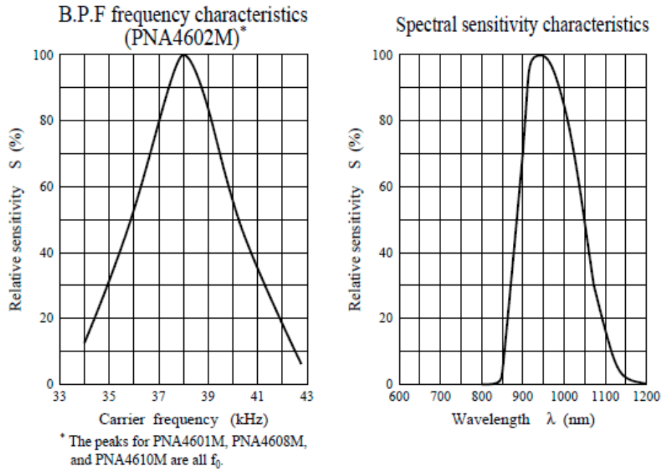
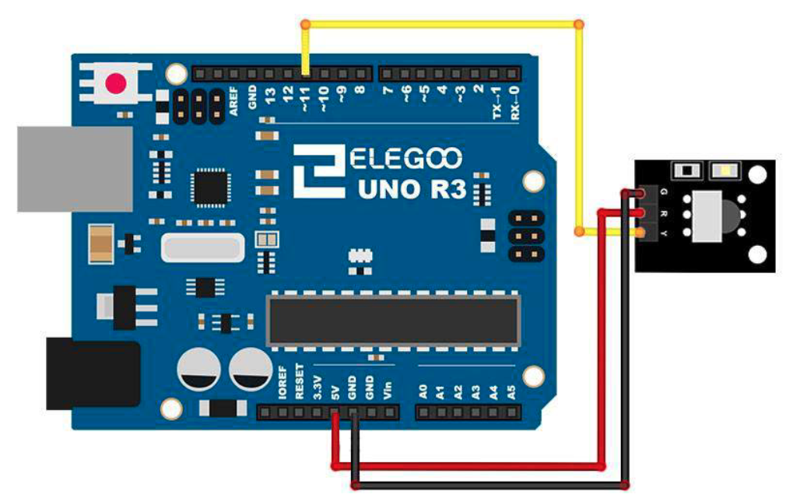

# IR Receiver Module

## Elegoo Lesson 14

[Uno Starter Kit.pdf > Page 102](../../docs/UNO%20Starter%20Kit.pdf)

### Overview

Using an IR Remote is a great way to have wireless control of your project.

Infrared remotes are simple and easy to use. In this tutorial we will be connecting the IR receiver to the UNO, and then use a Library that was designed for this particular sensor.

In our sketch we will have all the IR Hexadecimal codes that are available on this remote, we will also detect if the code was recognized and also if we are holding down a key.

**Components Required:**

* (1) x Elegoo Uno R3
* (1) x IR receiver module
* (1) x IR remot
* (3) x F-M wires (Female to Male DuPont wires)

**Component Introduction**

#### IR RECEIVER SENSOR:

IR detectors are little microchips with a photocell that are tuned to listen to infrared light.

They are almost always used for remote control detection - every TV and DVD player has one of these in the front to listen for the IR signal from the clicker.

Inside the remote control is a matching IR LED, which emits IR pulses to tell the TV to turn on, off or change channels.

IR light is not visible to the human eye, which means it takes a little more work to test a setup.

There are a few difference between these and say a CdS Photocells: IR detectors are specially filtered for IR light, they are not good at detecting visible light.

On the other hand, photocells are good at detecting yellow/green visible light, and are not good at IR light.

IR detectors have a demodulator inside that looks for modulated IR at 38 KHz. Just shining an IR LED won't be detected, it has to be PWM blinking at 38KHz.

Photocells do not have any sort of demodulator and can detect any frequency (including DC) within the response speed of the photocell (which is about 1KHz)

IR detectors are digital out - either they detect 38KHz IR signal and output low (0V) or they do not detect any and output high (5V). Photocells act like resistors, the resistance changes depending on how much light they are exposed to.

#### What you can measure

As you can see from these datasheet graphs, the peak frequency detection is at 38 KHz and the peak LED color is 940 nm. You can use from about 35 KHz to 41 KHz but the sensitivity will drop off so that it won't detect as well from afar.

Likewise, you can use 850 to 1100 nm LEDs but they won't work as well as 900 to 1000nm so make sure to get matching LEDs! Check the datasheet for your IR LED to verify the wavelength.

Try to get a 940nm - remember that 940nm is not visible light!

### Wiring Diagram

There are 3 connections to the IR Receiver.
The connections are: Signal, Voltage and Ground.
The “-” is the Ground, “S” is signal, and middle pin is Voltage 5V

### Code

After wiring, please open the program in the code folder- Lesson 14 IR Receiver Module and click UPLOAD to upload the program. See Lesson 2 for details about program uploading if there are any errors.

Before you can run this, make sure that you have installed the `<IRremote>` library or re-install it, if necessary. Otherwise, your code won't work.

For details about loading the library file, see Lesson 1.

Next we will move the <RobotIRremote> out of the Library folder, we do this
because that library conflicts with the one we will be using. You can just drag it back inside the library folder once you are done programming your microcontroller.

Once you have installed the Library, just go ahead and restart your IDE Software.

### Installing the library via CLion and Platform.io

1. Make a copy of the `platformio.ini` file because the procedure is gonna delete any comments or formatting you might have.
2. Open the Platform.io panel
3. Click the **PlatformIO Home** menu option.
4. Open [127.0.0.1:8008](http://127.0.0.1:8008)
5. Login. Details are in Password Manager.
6. Search for **IRremote by Armin Joachimsmeyer** and add it to the project
7. Copy the sample code to  this lesson folder.
8. Unzip, and tidy up any files.
9. Upload and monitor.

## Result

https://github.com/user-attachments/assets/ab9b04e1-9576-40ab-8cf9-681225c05e26
