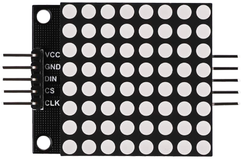
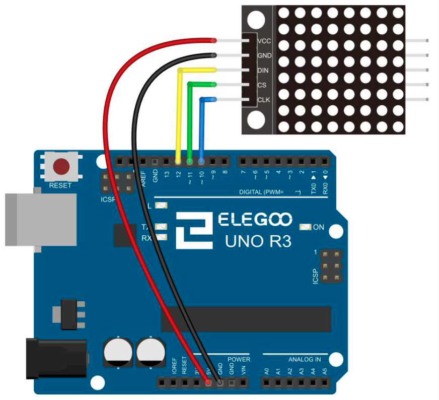

# MAX7219 LED Dot Matrix Module

## Elegoo Lesson 15

[Uno Starter Kit.pdf > Page 108](../../docs/UNO%20Starter%20Kit.pdf)

### Overview

In this tutorial we will connect a MAX7219 and scroll the text across.

Since these modules use the MAX7219 LED driver chip, we will be able to turn on and off the 64 LEDs of each module, using only 3 pins on our UNO..

**Components Required:**

* (1) x Elegoo Uno R3
* (1) x Max7219 module
* (5) x F-M wires (Female to Male DuPont wires)

**Component Introduction**

#### MAX7219 LED Dot Matrix Module:

Our project is in fact an Arduino with Serially Interfaced MAX7219 Operates an 8X8 LED Matrix.

The MAX7219 IC is a serial input/output common-cathode display driver that interfaces microprocessors to a 7-segment numeric LED displays of up to 8 digits, bar-graph displays, or 64 individual LEDs.

For convenience, here an 8×8 LED matrix, integrated with a MAX7219 IC setup, available as a pre-wired module is used.

Typical specification of this LED Matrix Module is shown below:

* Operating Voltage: DC 4.7V – 5.3V
* Typical Voltage: 5V
* Operating Current: 320mA
* Max Operating Current: 2A

### Wiring Diagram

VCC and Ground are connected to the Arduino.

Pin 12 is connected to DIN, Pin 11 is connected to CS and Pin 10 is connected to CLK.

### Code

Our Sketch will make use of the **Maxmatrix** Library to communicate with the MAX7219 modules.

After wiring, please open the program in the code folder- Lesson 15 MAX7219 LED Dot Matrix Module and click UPLOAD to upload the program.

See Lesson 2 for details about program uploading if there are any errors.

Before you can run this, make sure that you have installed the `<LedControl>` library or re-install it, if necessary. Otherwise, your code won't work.
For details about loading the library file, see Lesson 1.

### Installing the library via CLion and Platform.io

1. Make a copy of the `platformio.ini` file because the procedure is gonna delete any comments or formatting you might have.
2. Open the Platform.io panel
3. Click the **PlatformIO Home** menu option.
4. Open [127.0.0.1:8008](http://127.0.0.1:8008)
5. Login. Details are in Password Manager.
6. Search for **LEDControl by Eberhard Fahle** and add it to the project
7. Copy the sample code to  this lesson folder.
8. Unzip, and tidy up any files.
9. Upload and monitor.

## Result

https://github.com/user-attachments/assets/8b2c2395-29c0-486a-8b8d-99f4b1b89f78
