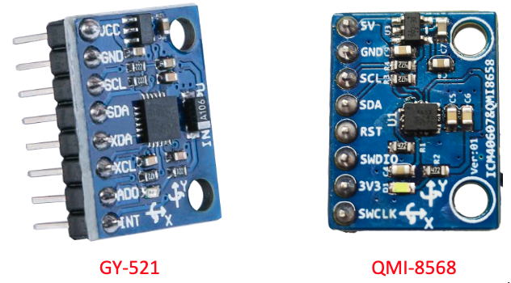
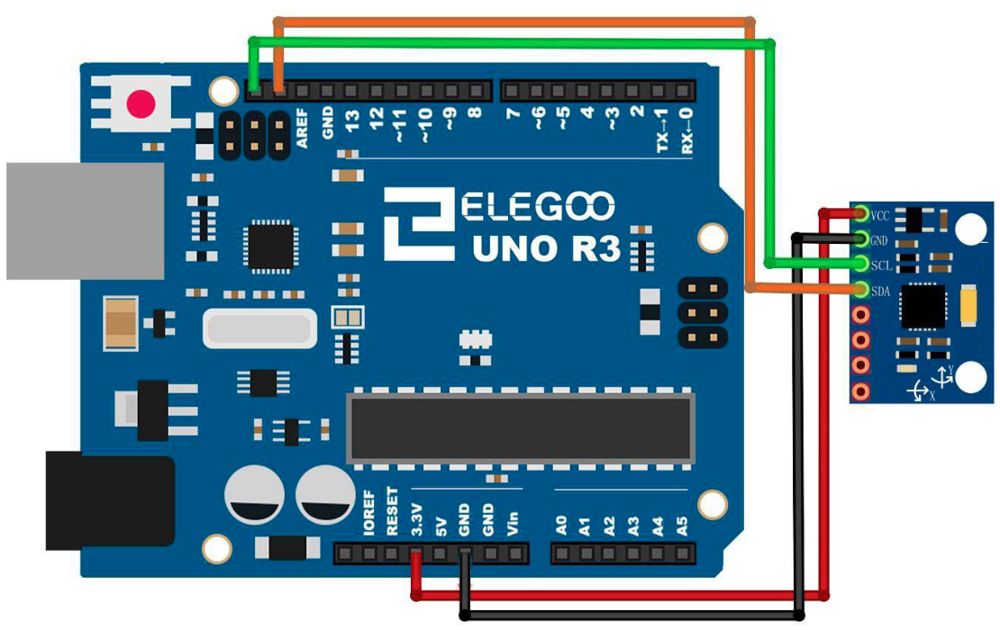

# MAX7219 LED Dot Matrix Module

## Elegoo Lesson 16

[Uno Starter Kit.pdf > Page 112](../../docs/UNO%20Starter%20Kit.pdf)

### Overview

In this lesson, we will learn how to use GY-521 module which is one of the best IMU (Inertia Measurement Unit) sensors, compatible with Arduino.

IMU sensors like the GY-521 are used in self balancing robots, UAVs, smart phones, etc.

**Components Required:**

* (1) x Elegoo Uno R3
* (1) x GY-521 module
* (5) x F-M wires (Female to Male DuPont wires)

**Component Introduction**

#### GY-521 SENSOR:

The InvenSense GY-521 sensor contains a MEMS accelerometer and a MEMS gyro in a single chip. It is very accurate, as it contains 16-bits analog to digital conversion hardware for each channel.

Therefore it captures the x, y, and z channel at the same time. The sensor uses the I2C-bus to interface with the Arduino.

The GY-521 is not expensive, especially given the fact that it combines both an accelerometer and a gyro

IMU sensors are one of the most inevitable type of sensors used today in all kinds of electronic gadgets.

They are seen in smart phones, wearables, game controllers, etc.

IMU sensors help us in getting the attitude of an object, attached to the sensor in three dimensional space. These values usually in angles, thus help us to determine its attitude.

Thus, they are used in smart phones to detect its orientation. And also in wearable gadgets like the nike fuel band or fit bit, which use IMU sensors to track movement

#### How does it work?

IMU sensors usually consists of two or more parts. Listing them by priority, they are:

1) accelerometer
2) gyroscope
3) magnetometer
4) altimeter

The GY-521 is a 6 DOF (Degrees of Freedom) or a six axis IMU sensor, which means that it gives six values as output.

Three values from the accelerometer and three from the gyroscope.

The GY-521 is a sensor based on MEMS (Micro Electro Mechanical Systems) technology. Both the accelerometer and the gyroscope is embedded inside a single chip. This chip uses I2C (Inter Integrated Circuit) protocol for communication.

See page 122 of [Uno Starter Kit.pdf](../../docs/UNO%20Starter%20Kit.pdf) for an excellent explanation of how accelerometers and gyroscopes work.

### Wiring Diagram

Next, we need to set up the I2C lines. For this connect the pin labelled as SDA on the GY-521 to the Arduino’s analog pin 4 (SDA).

And the pin labelled as SCL on the GY-521 to the Arduino’s analog pin 5 (SCL). A

nd that’s it, you have finished wiring up the Arduino GY-521

### Code

The short example sketch is a very short sketch and it shows all the raw values (accelerometer, gyro and temperature).

It should work on Arduino Uno, Nano, Leonardo, and also Due.

After wiring, please open the program in the code folder - Lesson 16 GY-521 Module and click UPLOAD to upload the program.

### Installing the library via CLion and Platform.io

1. Make a copy of the `platformio.ini` file because the procedure is gonna delete any comments or formatting you might have.
2. Open the Platform.io panel
3. Click the **PlatformIO Home** menu option.
4. Open [127.0.0.1:8008](http://127.0.0.1:8008)
5. Login. Details are in Password Manager.
6. Search for **MPU-6050 by Adafruit** and add it to the project
7. You will also need to install:
   1. Adafruit BusIO
   2. Adafruit GXF Library
   3. Adafruit SSD1306
   4. Adafruit Unified Sensor
8. Copy the sample code to  this lesson folder.
9. Unzip, and tidy up any files.
10. Upload and monitor.

## Result

