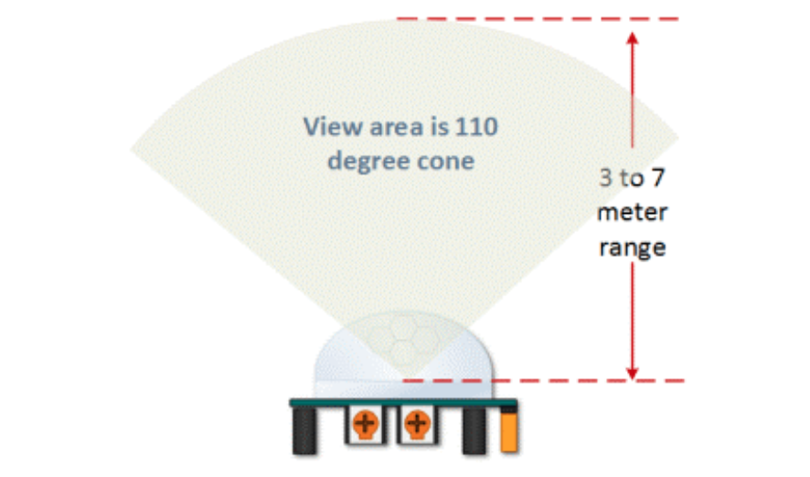
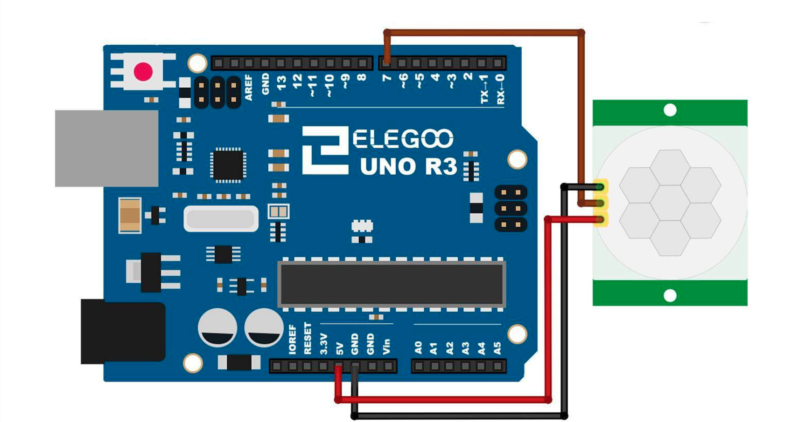

# HC-SR501 PIR Sensor

## Elegoo Lesson 17

[Uno Starter Kit.pdf > Page 121](../../docs/UNO%20Starter%20Kit.pdf)

### Overview

In this lesson you will learn how to use a PIR movement detector with an UNO.

The UNO is the heart of this project. It 'listens' to the PIR sensor and when motion is detected, instructs the LED to light on or shut off

**Components Required:**

* (1) x Elegoo Uno R3
* (1) x HC-SR501 PIR motion sensor
* (3) x F-M wires (Female to Male DuPont wires)

**Component Introduction**

### HC-SR501 SENSOR:

PIR sensors are more complicated than many of the other sensors explained in this tutorial (like photocells, FSRs and tilt switches) because there are multiple variables that affect the sensors input and output.

The PIR sensor itself has two slots. Each slot is made of a special material that is sensitive to IR. The lens used here is not really doing much and so we see that the two slots can 'see' out past some distance (basically the sensitivity of the sensor).

When the sensor is idle, both slots detect the same amount of IR, the ambient amount radiated from the room or walls or outdoors.

When a warm body like a human or an animal passes by, it first intercepts one half of the PIR sensor, which causes a positive differential change between the two halves.

When the warm body leaves the sensing area, the reverse happens, whereby the sensor generates a negative differential change.

These change pulses are what is detected

| Pin or Control           | Function                                                                                               |
| ------------------------ | ------------------------------------------------------------------------------------------------------ |
| Time Delay Adjust        | Sets how long the output remains high after detecting motion ... Anywhere from 5 seconds to 5 minutes. |
| Sensitivity Adjust       | Sets the detection range.... from 3 meters to 7 meters                                                 |
| Trigger Selection Jumper | Set for single or repeatable triggers                                                                  |
| Ground pin               | Ground input                                                                                           |
| Output Pin               | Low when no motion is detected.. High when motion is detected. High is 3.3V                            |
| Power Pin                | 5 to 20 VDC Supply input                                                                               |

### HC SR501 PIR Functional Description

The SR501 will detect infrared changes and if interpreted as motion, will set its output low.

What is or is not interpreted as motion is largely dependent on user settings and adjustments.

#### Device Initialization

The device requires nearly a minute to initialize. During this period, it can and often will output false detection signals.

Circuit or controller logic needs to take this initialization period into consideration.

#### Device Area of Detection

The device will detect motion inside a 110 degree cone with a range of 3 to 7 meters.

#### HC SR501 View Area

PIR Range (Sensitivity) Adjustment

The adjustable range is from approximately 3 to 7 meters. The illustration below shows this adjustment

#### HC SR501 Time Delay Adjustment

3 Seconds Off After Time Delay Completes

##### IMPORTANT

The output of this device will go LOW (or Off) for approximately 3 seconds AFTER the time delay completes.

In other words, ALL motion detection is blocked during this
three second period

##### Example

Imagine you’re in the single trigger mode and your time delay is set 5 seconds.

The PIR will detect motion and set it high for 5 seconds.

After five seconds, the PIR will sets its output low for about 3 seconds.

During the three seconds, the PIR will not detect motion.

After three seconds, the PIR will detect motion again and detected motion will once again set the output high.

### Trigger Mode Selection Jumper

The trigger mode selection jumper allows you to select between single and repeatable triggers.

The affect of this jumper setting is to determine when the time delay begins.

* **SINGLE TRIGGER** – The time delay begins immediately when motion is first detected.
* **REPEATABLE TRIGGER** – Each detected motion resets the time delay. Thus the time delay begins with the last motion detected.

### HC-SR501 Dance Floor Application Examples

Imagine that you want to control lighting on a dance floor based upon where the dancers are dancing. Understanding how the time delay and trigger mode interact will be necessary to controlling that lighting in the manner that you want.

#### Example One

In this first example, the time delay is set to three seconds and the trigger mode is set to single. As you can see in the illustration below, the motion is not always detected.

In fact, there is a period of about six seconds where motion can not be detected.

#### Example Two

In the next example, the time delay is still at three seconds and the trigger is set to repeatable.

In the illustration below, you can see that the time delay period is
restarted. However, after that three seconds, detection will still be blocked for three seconds.

As I mentioned previously, you could override the 3 second blocking period with some creative code, but do give that consideration. Some of the electronics you use may not like an on and then off jolt.

The three seconds allows for a little rest before starting back up.

## Wiring Diagram

Connecting PIR sensors to a microcontroller is really simple.

The PIR acts as a digital output so all you need to do is listen for the pin to flip high (detected) or low (not detected).

It’s likely that you'll want retriggering, so be sure to put the jumper in the H position!

Power the PIR with 5V and connect ground to ground. Then connect the output to a digital pin. In this example, we'll use pin 7.

### Code

After wiring, please open the program in the code folder - **Lesson 17 HC-SR501 PIR** Sensor and click UPLOAD to upload the program.

The sketch simply turns on Your Arduino LED connected to Pin 13 whenever motion is detected.

Be sure to beware of and somehow handle the 1 minute initialization in whatever application you develop

### Installing the library via CLion and Platform.io

1. Make a copy of the `platformio.ini` file because the procedure is gonna delete any comments or formatting you might have.
2. Open the Platform.io panel
3. Click the **PlatformIO Home** menu option.
4. Open [127.0.0.1:8008](http://127.0.0.1:8008)
5. Login. Details are in Password Manager.
6. Search for **MPU-6050 by Adafruit** and add it to the project
7. You will also need to install:
   1. Adafruit BusIO
   2. Adafruit GXF Library
   3. Adafruit SSD1306
   4. Adafruit Unified Sensor
8. Copy the sample code to  this lesson folder.
9. Unzip, and tidy up any files.
10. Upload and monitor.

## Result

