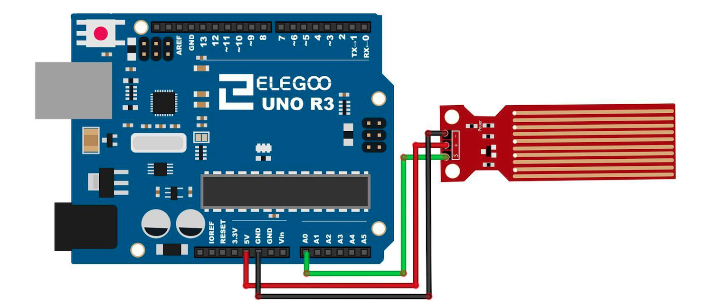

# Water level detection module

## Elegoo Lesson 18

[Uno Starter Kit.pdf > Page 131](../../docs/UNO%20Starter%20Kit.pdf)

### Overview

In this lesson, you will learn how to use a water level detection sensor module.

This module can perceive the depth of water and the core component is an amplifying circuit which is made up of a transistor and several pectinate PCB routings.

When put into the water, these routings will present a resistor that can change along with the change of the water’s depth. Then, the signal of water's depth is converted into the electrical signal, and we can know the change of water's depth through the ADC function of UNO R3.

**Components Required:**

* (1) x Elegoo Uno R3
* (1) x Water lever detection sensor module
* (3) x F-M wires (Female to Male DuPont wires)

**Component Introduction**

### Water sensor:

A water sensor brick is designed for water detection, which can be widely used in sensing the rainfall, water level, even the liquate leakage.

The brick is mainly composed of three parts: an electronic brick connector, a 1 MΩ resistor, and several lines of bare conducting wires.

This sensor works by having a series of exposed traces connected to ground.

Interlaced between the grounded traces are the sense traces.
The sensor traces have a weak pull-up resistor of 1 MΩ. The resistor will pull the sensor trace value high until a drop of water shorts the sensor trace to the grounded
trace.

Believe it or not this circuit will work with the digital I/O pins of your UNO R3 board or you can use it with the analog pins to detect the amount of water induced contact between the grounded and sensor traces.

This item can judge the water level through with a series of exposed parallel wires stitch to measure the water droplet/water size.

It can easily change the water size to analog signal, and output analog value can directly be used in the program function, then to achieve the function of water level alarm.

It has low power consumption, and high sensitivity.

#### Features:

* Working voltage: 5V
* Working Current: <20ma 3、
* Interface: Analog
* Width of detection: 40mm×16mm
* Working Temperature: 10℃ ~ 30℃
* Output voltage signal: 0~4.2V

### Wiring Diagram

**Wiring tips:** Power supply (+) is connected to 5V of UNO R3 board, ground electrode (-) is connected to GND. Signal output (S) is connected to the ports (A0-A5) which have function of inputting analog signal in UNO R3 board, random one is OK, but it
should define the same demo code as the routine.

## Result

