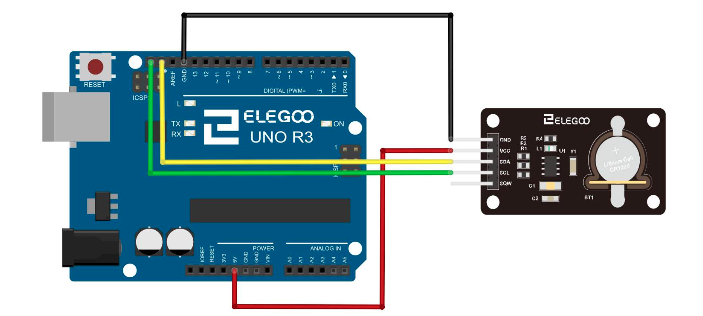

# Realtime Clock module

## Elegoo Lesson 19

[Uno Starter Kit.pdf > Page 136](../../docs/UNO%20Starter%20Kit.pdf)

### Overview

In this lesson, you will learn how to use the RTC module, The DS1307 real-time clock is a low-power chip.

Address and data are transferred serially through an I2C, which can be used unless being connected to UNO with only three data cables.

DS1307 provides seconds, minutes, hours, day, date, month, and year
information. Timekeeping operation continues while the part operates from the backup supply.

**Components Required:**

* (1) x Elegoo Uno R3
* (1) x DS1307 RTC module
* (4) x F-M wires (Female to Male DuPont wires)

### Wiring Diagram

Set up according to the following image.

Ignore the 32K and SQW pins; you will not need them. Plug the SCL pin into your UNO R3 board SCL port, and the SDA pin into the SDA port.

The VCC pin plugs into the 5V port, and the GND plugs into the GND port.

### Installing the library via CLion and Platform.io

1. Make a copy of the `platformio.ini` file because the procedure is gonna delete any comments or formatting you might have.
2. Open the Platform.io panel
3. Click the **PlatformIO Home** menu option.
4. Open [127.0.0.1:8008](http://127.0.0.1:8008)
5. Login. Details are in Password Manager.
6. Search for **DS1307 by Denics Devices (Aaditya Dengle)** and add it to the project
7. Copy the sample code to  this lesson folder.
8. Unzip, and tidy up any files.
9. Upload and monitor.

## Result

