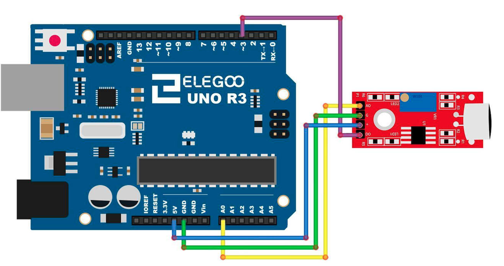

# Sound Sensor module

## Elegoo Lesson 20

[Uno Starter Kit.pdf > Page 141](../../docs/UNO%20Starter%20Kit.pdf)

### Overview

In this lesson, you will learn how to use a sound sensor module. This module has two outputs:

AO: analog output, real-time output voltage signal of microphone

DO: when the intensity of the sound reaches a certain threshold, the output is a high or low level signal. The threshold sensitivity can be achieved by adjusting the potentiometer.

To make sure the microphone can detect your voice normally, please try to change its sensitivity by turning the blue precise potentiometer on the module.

Given to its preciseness, it takes at least 10 circles for you to get some response.

**Components Required:**

* (1) x Elegoo Uno R3
* (1) x Sound sensor module
* (4) x F-M wires (Female to Male DuPont wires)

### Component Introduction

The sound sensor module provides an easy way to detect sound and is generally used for detecting sound intensity.

This module can be used for security, switch, and monitoring applications. Its accuracy can be easily adjusted for the convenience
of usage. It uses a microphone which supplies the input to an amplifier, peak detector and buffer.

When the sensor detects a sound, it processes an output signal voltage which is sent to a microcontroller then performs necessary processing.

These microphones are widely used in electronic circuits to detect minor sounds or
air vibrations which in turn are converted to electrical signals for further use. The
two legs as shown in the image above are used to make electrical connection with
the circuit.

### Wiring Diagram

After wiring, please open the program in the code folder(Lesson 20 SOUND SENSOR MODULE) and click UPLOAD to upload the program.

See Lesson 3 for details about program uploading if there are any errors.

High-sensitive Voice Sensor has two output:

- **AO**: analog output, real-time output voltage signal of microphone
- **DO**: digital output when the intensity of the sound to reach a certain threshold, the output high and low level signal, the threshold-sensitivity can be achieved by potentiometer adjustment period.

**Please note** that you need to spin the screw counterclockwise by a screwdriver until the LED 2 goes out, and then use the screwdriver to adjust the 10K potentiometer.

### Notes

This sensor doesn't display a waverform from music very well/at all. The resolution of the values recorded is quite low. The best I could do was scratch the microphone to record something that created a large enough range to display something meaningful on the Serial Plotter.

I am using [Serial Monitor Rust app](https://github.com/hacknus/serial-monitor-rust) to display the values as a graph.

## Result

