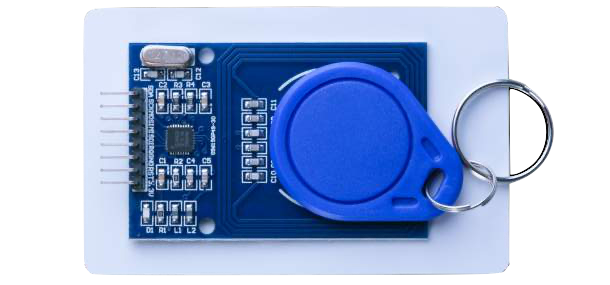
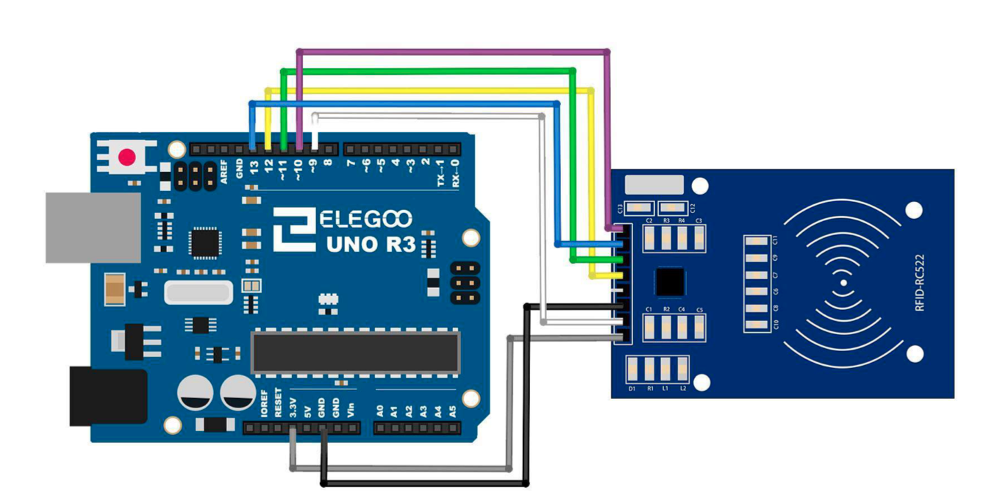

# RC522 RFID Module

## Elegoo Lesson 20

[Uno Starter Kit.pdf > Page 147](../../docs/UNO%20Starter%20Kit.pdf)

### Overview

In this lesson, you will learn to how to apply the RC522 RFID Reader Module on UNO R3. This module uses the Serial Peripheral Interface (SPI) bus to communicate with controllers such as Arduino, Raspberry Pi, beagle board, etc.

**Components Required:**

* (1) x Elegoo Uno R3
* (1) x RC522 RFID module
* (7) x F-M wires (Female to Male DuPont wires)



### Component Introduction

The MFRC522 is a highly integrated reader/writer for contactless communication at

13.56 MHz. The MFRC522 reader supports ISO 14443A / MIFARE® mode.

The MFRC522’s internal transmitter part is able to drive a reader/writer antenna designed to communicate with ISO/IEC 14443A/MIFARE® cards and transponders without additional active circuitry.

The receiver part provides a robust and efficient implementation of a demodulation and decoding circuitry for signals from ISO/IEC 14443A/MIFARE® compatible cards and transponders.

The digital part handles the complete ISO/IEC 14443A framing and error detection (Parity & CRC).The MFRC522 supports MIFARE®Classic (e.g. MIFARE® Standard) products.

The MFRC522 supports contactless communication using MIFARE® higher transfer speeds up to 848 kbit/s in both directions.

Various host interfaces are implemented:

* SPI interface
* Serial UART (similar to RS232 with voltage levels according pad voltage supply)
* I2C interface.

### Wiring Diagram



After wiring, please open the program in the code folder - **Lesson 21 RC522 RFID Module** and press UPLOAD to upload the program. See Lesson 2 for details about program uploading if there are any errors.

Before you can run this, make sure that you have installed the < rfid > library or reinstall it, if necessary. Otherwise, your code won't work.


| Signal    | MERC522 Reader/PCD Pin | Ar duino Uno Pin | Arduino Arduino Mega Pin | Mano v3 Pin | Ar dui no Leonardo/Micro Pin | Ar duino Pro Micro Pin |
| --------- | ---------------------- | ---------------- | ------------------------ | ----------- | ---------------------------- | ---------------------- |
| RST/Reset | RST                    | <br/>9           | 5                        | <br/>       | RESET/ICSP-5                 | RST                    |
| SPI SS    | SDA (SS)               | 10               | 53                       | D10         | 10                           | 10                     |
| SPI MOSI  | MOSI                   | 11 / ICSP-4      | 51                       | D11         | ICSP-4                       | 16                     |
| SPI MISO  | MISO                   | 12 / ICSP-1      | 50                       | D12         | ICSP-1                       | 14                     |
| SPI SCK   | SCK                    | 13 / ICSP-3      | 52                       | D13         | ICSP-3                       | 15                     |

```c
#define RST_PIN 9 // Configurable, see typical pin layout above
#define SS_PIN 10 // Configurable, see typical pin layout above
```

The locations of SPI pins vary with different chips, and you have to make a minor modification of the function.

### Notes

My walkthrough of this lesson only confirms that I can detect the keyfob and not if I can read/write/action data from the fob.

### Installing the library via CLion and Platform.io

1. Make a copy of the `platformio.ini` file because the procedure is gonna delete any comments or formatting you might have.
2. Open the Platform.io panel
3. Click the **PlatformIO Home** menu option.
4. Open [127.0.0.1:8008](http://127.0.0.1:8008)
5. Login. Details are in Password Manager.
6. Search for **MFRC522 by Miki Balboa** and add it to the project
7. Copy the sample code to  this lesson folder.
8. Unzip, and tidy up any files.
9. Upload and monitor.

## Result


