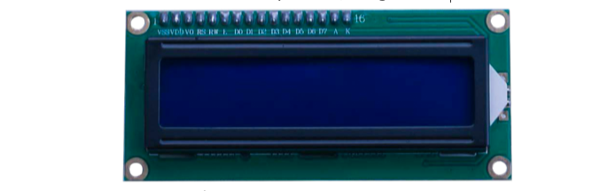
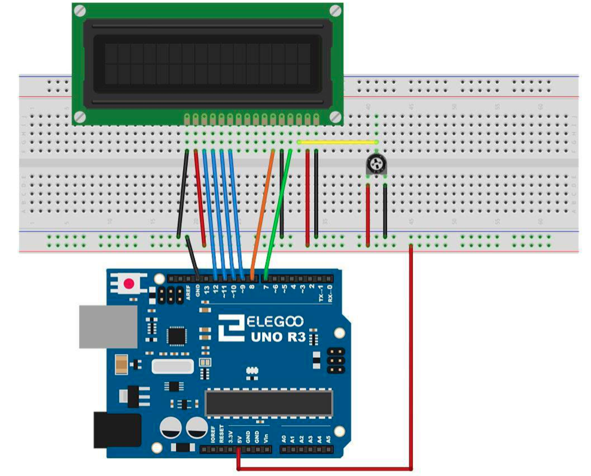

# LCD Display

## Elegoo Lesson 22

[Uno Starter Kit.pdf > Page 152](../../docs/UNO%20Starter%20Kit.pdf)

### Overview

In this lesson, you will learn how to wire up and use an alphanumeric LCD display.

The display has an LED backlight and can display two rows with up to 16 characters on each row.

You can see the rectangles for each character on the display and the pixels that make up each character.

The display is just white on blue and is intended for showing text.

In this lesson, we will run the Arduino example program for the LCD library, but in [lesson 23](../22_temp_display/), we will get our display to show the temperature, using sensors.

**Components Required:**

* (1) x Elegoo Uno R3
* (1) x LCD1602 module
* (1) x Potentiometer (10k)
* (16) x M-M wires (Male to Male DuPont wires)



### LCD1602 Component Introduction

Introduction to the pins of LCD1602:

* **VSS**: A pin that connects to ground
* **VDD**: A pin that connects to a +5V power supply
* **VO**: A pin that adjust the contrast of LCD1602
* **RS**: A register select pin that controls where in the LCD’s memory you are writing data to. You can select either the data register, which holds what goes on the screen, or an instruction register, which is where the LCD’s controller looks for instructions on what to do next.
* **R/W**: A Read/Write pin that selects reading mode or writing mode E: An enabling pin that, when supplied with low-level energy, causes the LDC module to execute relevant instructions.
* **D0-D7**：Pins that read and write data
* **A and K**: Pins that control the LED backlight

### Wiring Diagram




The LCD display needs six Arduino pins, all set to be digital outputs. It also needs 5V and GND connections.

There are a number of connections to be made. Lining up the display with the top of the breadboard helps to identify its pins without too much counting, especially if the breadboard has its rows numbered with row 1 as the top row of the board.

Do not forget, the long yellow lead that links the slider of the pot to pin 3 of the display. The 'pot' is used to control the contrast of the display.

You may find that your display is supplied without header pins attached to it. If so, follow the instructions in the next section.


| Signal    | MERC522 Reader/PCD Pin | Ar duino Uno Pin | Arduino Arduino Mega Pin | Mano v3 Pin | Ar dui no Leonardo/Micro Pin | Ar duino Pro Micro Pin |
| --------- | ---------------------- | ---------------- | ------------------------ | ----------- | ---------------------------- | ---------------------- |
| RST/Reset | RST                    | <br/>9           | 5                        | <br/>       | RESET/ICSP-5                 | RST                    |
| SPI SS    | SDA (SS)               | 10               | 53                       | D10         | 10                           | 10                     |
| SPI MOSI  | MOSI                   | 11 / ICSP-4      | 51                       | D11         | ICSP-4                       | 16                     |
| SPI MISO  | MISO                   | 12 / ICSP-1      | 50                       | D12         | ICSP-1                       | 14                     |
| SPI SCK   | SCK                    | 13 / ICSP-3      | 52                       | D13         | ICSP-3                       | 15                     |

```c
#define RST_PIN 9 // Configurable, see typical pin layout above
#define SS_PIN 10 // Configurable, see typical pin layout above
```

The locations of SPI pins vary with different chips, and you have to make a minor modification of the function.

### Notes

My walkthrough of this lesson only confirms that I can detect the keyfob and not if I can read/write/action data from the fob.

### Installing the library via CLion and Platform.io

1. Make a copy of the `platformio.ini` file because the procedure is gonna delete any comments or formatting you might have.
2. Open the Platform.io panel
3. Click the **PlatformIO Home** menu option.
4. Open [127.0.0.1:8008](http://127.0.0.1:8008)
5. Login. Details are in Password Manager.
6. Search for **LiquidCrystal by Adfruit** and add it to the project
7. Copy the sample code to  this lesson folder.
8. Unzip, and tidy up any files.
9. Upload and monitor.

## Result


https://github.com/user-attachments/assets/80e5e05a-95ee-4e3f-ae1c-945423c3f23d

