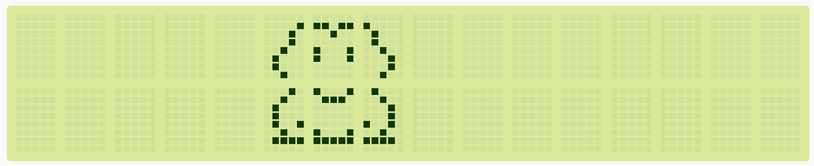

# LCD Display

## Elegoo Lesson 22

[Uno Starter Kit.pdf > Page 152](../../docs/UNO%20Starter%20Kit.pdf)

### Overview

In this lesson, you will learn how to wire up and use an alphanumeric LCD display.

The display has an LED backlight and can display two rows with up to 16 characters on each row.

You can see the rectangles for each character on the display and the pixels that make up each character.

The display is just white on blue and is intended for showing text.

In this lesson, we will run the Arduino example program for the LCD library, but in [lesson 23](../22_temp_display/), we will get our display to show the temperature, using sensors.

**Components Required:**

* (1) x Elegoo Uno R3
* (1) x LCD1602 module
* (1) x Potentiometer (10k)
* (16) x M-M wires (Male to Male DuPont wires)


### LCD1602 Component Introduction

Introduction to the pins of LCD1602:

* **VSS**: A pin that connects to ground
* **VDD**: A pin that connects to a +5V power supply
* **VO**: A pin that adjust the contrast of LCD1602
* **RS**: A register select pin that controls where in the LCD’s memory you are writing data to. You can select either the data register, which holds what goes on the screen, or an instruction register, which is where the LCD’s controller looks for instructions on what to do next.
* **R/W**: A Read/Write pin that selects reading mode or writing mode E: An enabling pin that, when supplied with low-level energy, causes the LDC module to execute relevant instructions.
* **D0-D7**：Pins that read and write data
* **A and K**: Pins that control the LED backlight

### Wiring Diagram


The LCD display needs six Arduino pins, all set to be digital outputs. It also needs 5V and GND connections.

There are a number of connections to be made. Lining up the display with the top of the breadboard helps to identify its pins without too much counting, especially if the breadboard has its rows numbered with row 1 as the top row of the board.

Do not forget, the long yellow lead that links the slider of the pot to pin 3 of the display. The 'pot' is used to control the contrast of the display.

### Code

After wiring, please open the program in the code folder - Lesson 22 LCD Display and click UPLOAD to upload the program. See Lesson 2 for details about program uploading if there are any errors.

Before you can run this, make sure that you have installed the `< LiquidCrystal >` library or re-install it, if necessary. Otherwise, your code won't work.

For details about loading the library file, see Lesson 1.

Upload the code to your Arduino board and you should see the message 'hello, world' displayed, followed by a number that counts up from zero.

The first thing of note in the sketch is the line:

`#include <LiquidCrystal.h>` This tells Arduino that we wish to use the Liquid Crystal library.

Next we have the line that we had to modify. This defines which pins of the Arduino are to be connected to which pins of the display.

`LiquidCrystal lcd(7, 8, 9, 10, 11, 12);` After uploading this code, make sure the backlight is lit up, and adjust the potentiometer all the way around until you see the text message In the 'setup' function, we have two commands:

`lcd.begin(16, 2); lcd.print("Hello, World!");` The first tells the Liquid Crystal library how many columns and rows the display has. The second line displays the message that we see on the first line of the screen.

In the 'loop' function, we aso have two commands:

`lcd.setCursor(0, 1); lcd.print(millis()/1000);`

The first sets the cursor position (where the next text will appear) to column 0 & row 1. Both column and row numbers start at 0 rather than 1.

The second line displays the number of milliseconds since the Arduino was reset.

### Notes

I used [Screenduino](https://nonnullish.github.io/screenduino/) to create the code for a custom frog glyph:



```cpp
void frog() {
    lcd.clear();

    byte image22[8] = {B00010, B00100, B01000, B01000, B01001, B00100, B01111, B00000};
    byte image06[8] = {B00000, B00001, B00010, B00010, B00100, B01000, B01000, B00100};
    byte image07[8] = {B00000, B11011, B00100, B00000, B10001, B10001, B00000, B00000};
    byte image08[8] = {B00000, B10000, B01000, B01000, B00100, B00010, B00010, B00100};
    byte image23[8] = {B10001, B01110, B00000, B00000, B00000, B10001, B11111, B00000};
    byte image24[8] = {B01000, B00100, B00010, B00010, B10010, B00100, B11110, B00000};

    lcd.createChar(0, image22);
    lcd.createChar(1, image06);
    lcd.createChar(2, image07);
    lcd.createChar(3, image08);
    lcd.createChar(4, image23);
    lcd.createChar(5, image24);

    lcd.setCursor(5, 1);
    lcd.write(byte(0));
    lcd.setCursor(5, 0);
    lcd.write(byte(1));
    lcd.setCursor(6, 0);
    lcd.write(byte(2));
    lcd.setCursor(7, 0);
    lcd.write(byte(3));
    lcd.setCursor(6, 1);
    lcd.write(byte(4));
    lcd.setCursor(7, 1);
    lcd.write(byte(5));
}
```

### Installing the library via CLion and Platform.io

1. Make a copy of the `platformio.ini` file because the procedure is gonna delete any comments or formatting you might have.
2. Open the Platform.io panel
3. Click the **PlatformIO Home** menu option.
4. Open [127.0.0.1:8008](http://127.0.0.1:8008)
5. Login. Details are in Password Manager.
6. Search for **LiquidCrystal by Adafruit** and add it to the project
7. Copy the sample code to  this lesson folder.
8. Unzip, and tidy up any files.
9. Upload and monitor.

## Result


https://github.com/user-attachments/assets/80e5e05a-95ee-4e3f-ae1c-945423c3f23d
