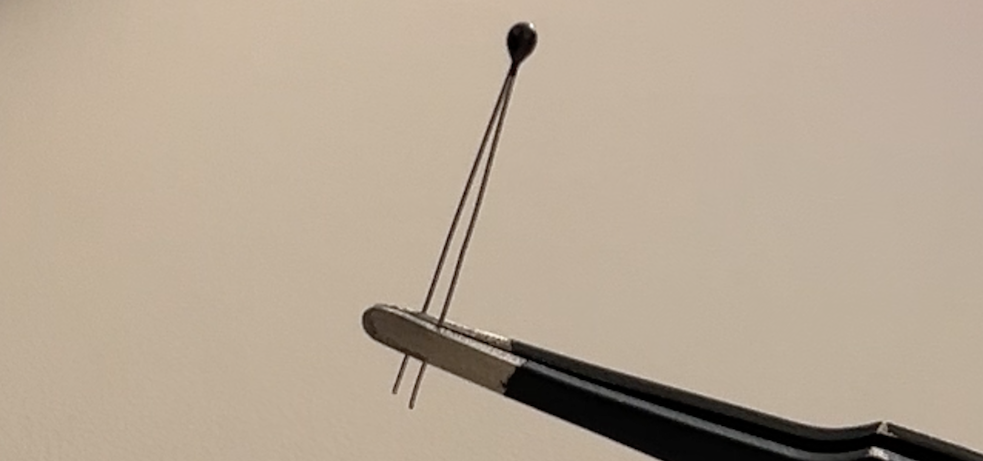
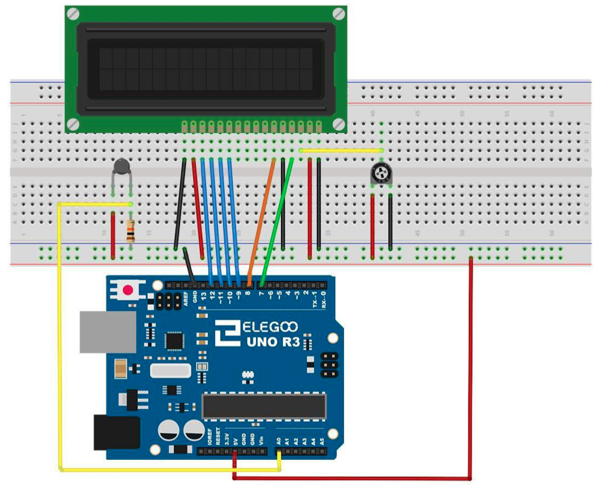

# Thermometer

## Elegoo Lesson 23

[Uno Starter Kit.pdf > Page 157](../../docs/UNO%20Starter%20Kit.pdf)

### Overview

In this lesson, you will use an LCD display to show the temperature.

**Components Required:**

* (1) x Elegoo Uno R3
* (1) x LCD1602 Module
* (1) x 10k ohm resistor
* (1) x Thermistor
* (1) x Potentiometer
* (1) x 830 tie-points Breadboard
* (18) x M-M wires (Male to Male jumper wires)



### Thermistor Component Introduction

A thermistor is a thermal resistor - a resistor that changes its resistance with temperature. Technically, all resistors are thermistors - their resistance changes slightly with temperature - but the change is usually very small and difficult to measure.

Thermistors are made so that the resistance changes drastically with temperature so that it can be 100 ohms or more of change per degree!

There are two kinds of thermistors, NTC (negative temperature coefficient) and PTC (positive temperature coefficient).

In general, you will see NTC sensors used for temperature measurement.

PTC's are often used as resettable fuses - an increase in temperature increases the resistance which means that as more current passes thru them, they heat up and 'choke back' the current, quite handy for protecting circuits!

### Wiring Diagram




The breadboard layout is based on the layout from Lesson 22, so it will simplify things if you still have this on the breadboard.

There are a few jumper wires near the pot that have been moved slightly on this layout.

The 10 kΩ resistor and thermistor are all new additions to the board.

### Code


After wiring, please open the program in the code folder- Lesson 23 Thermometer and click UPLOAD to upload the program. See Lesson 2 for details about program uploading if there are any errors.

Before you can run this, make sure that you have installed the < LiquidCrystal > library or re-install it, if necessary. Otherwise, your code won't work.

For details about loading the library file, see Lesson 1.

The sketch for this is based on that of lesson 22. Load it up onto your Arduino and you should find that warming the temperature sensor by putting your finger on it will increase the temperature reading.

I find it useful to put a comment line above the 'lcd' command.

```cpp
// BS E D4 D5 D6 D7
LiquidCrystal lcd(7, 8, 9, 10, 11, 12);
```

This makes things easier if you decide to change which pins you use.

In the 'loop' function there are now two interesting things going on. Firstly we have to convert the analog from the temperature sensor into an actual temperature, and secondly we have to work out how to display them.

First of all, let's look at calculating the temperature.

```cpp
float tempF = (tempC * 9.0)/ 5.0 + 32.0;
int tempReading = analogRead(tempPin); 
double tempK = log(10000.0 * ((1024.0 / tempReading - 1)));
tempK = 1 / (0.001129148 + (0.000234125 + (0.0000000876741 * tempK * tempK )) * tempK );
float tempC = tempK - 273.15;

float tempF = (tempC * 9.0)/ 5.0 + 32.0;
```

Displaying changing readings on an LCD display can be tricky. The main problem is that the reading may not always be the same number of digits.

So, if the temperature changed from 101.50 to 99.00 then the extra digit from the old reading is in danger of being left on the display.

To avoid this, write the whole line of the LCD each time around the loop.

```cpp
lcd.setCursor(0, 0);
lcd.print("Temp C ");
lcd.setCursor(6, 0);
lcd.print(tempF);

```

The rather strange comment serves to remind you of the 16 columns of the display. You can then print a string of that length with spaces where the actual reading will go.

To fill in the blanks, set the cursor position for where the reading should appear and then print it.

### Result


