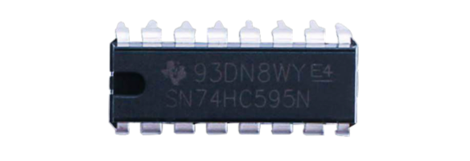
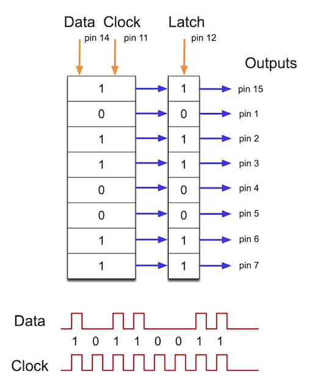
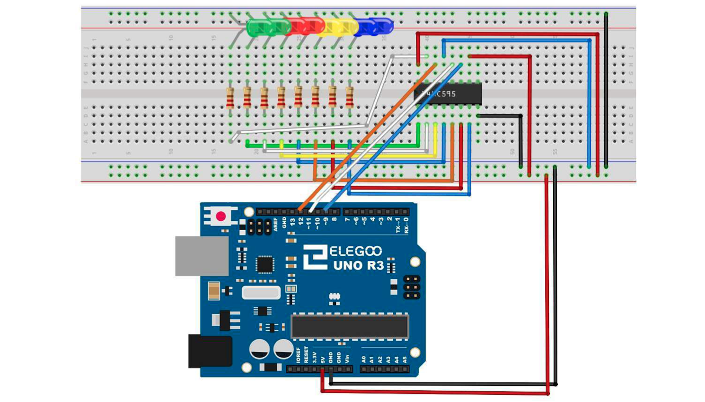

# Eight LED with 74HC595

## Elegoo Lesson 24

[Uno Starter Kit.pdf > Page 162](../../docs/UNO%20Starter%20Kit.pdf)

### Overview

In this lesson, you will learn how to use eight large red LEDs with an UNO without needing to give up 8 output pins!

Although you could wire up eight LEDs each with a resistor to an UNO pin you would rapidly start to run out of pins on your UNO. If you don't have a lot of stuff connected to your UNO. It's OK to do so - but often times we want buttons, sensors, servos, etc. and before you know it you've got no pins left. So, instead of doing that, you are going to use a chip called the 74HC595 Serial to Parallel Converter. This chip has eight outputs (perfect) and three inputs that you use to feed data into it a bit at a time.

This chip makes it a little slower to drive the LEDs (you can only change the LEDs about 500,000 times a second instead of 8,000,000 a second) but it's still really fast, way faster than humans can detect, so it's worth it!

**Components Required:**

* (1) x Elegoo Uno R3
* (1) x 830 tie-points breadboard
* (8) x leds
* (8) x 220 ohm resistors
* (1) x 74hc595 IC
* (14) x M-M wires (Male to Male jumper wires)



### 74HC595 Shift Register

The shift register is a type of chip that holds what can be thought of as eight memory locations, each of which can either be a 1 or a 0.

To set each of these values on or off, we feed in the data using the 'Data' and 'Clock' pins of the chip.



The clock pin needs to receive eight pulses. At each pulse, if the data pin is high, then a 1 gets pushed into the shift register; otherwise, a 0.

When all eight pulses have been received, enabling the 'Latch' pin copies those eight values to the latch register.

This is necessary; otherwise, the wrong LEDs would flicker as the data is being loaded into the shift register.

The chip also has an output enable (OE) pin, which is used to enable or disable the outputs all at once.

You could attach this to a PWM-capable UNO pin and use 'analogWrite' to control the brightness of the LEDs.

This pin is active low, so we tie it to GND.

### Wiring Diagram



As we have eight LEDs and eight resistors to connect, there are actually quite a few connections to be made.

It is probably easiest to put the **74HC595** chip in first, as pretty much everything else connects to it. Put it so that the little U-shaped notch is towards the top of the breadboard. Pin 1 of the chip is to the left of this notch.

`Digital 12` from the UNO goes to pin #14 of the shift register Digital 11 from the UNO goes to `pin #12` of the shift register `Digital 9` from the UNO goes to pin #11 of the shift register All but one of the outputs from the IC is on the left side of the chip. Hence, for ease of connection, that is where the LEDs are, too.

After the chip, put the resistors in place. You need to be careful that none of the leads of the resistors are touching each other. You should check this again before you connect the power to your UNO. If you find it difficult to arrange the resistors without their leads touching, then it helps to shorten the leads so that they are lying closer to the surface of the breadboard.

Next, place the LEDs on the breadboard. The longer positive LED leads must all be towards the chip, whichever side of the breadboard they are on.

Attach the jumper leads as shown above. Do not forget the one that goes from `pin 8` of the IC to the GND column of the breadboard.

Load up the sketch listed a bit later and try it out. Each LED should light in turn until all the LEDs are on, and then they all go off and the cycle repeats.

### Code

After wiring, please open the program in the code folder - **Lesson 24 Eight LED with74HC595** and click UPLOAD to upload the program. See Lesson 2 for details about program uploading if there are any errors.

The first thing we do is define the three pins we are going to use. These are the UNO digital outputs that will be connected to the latch, clock and data pins of the **74HC595**.

```cpp
int latchPin = 11;
int clockPin = 9;
int dataPin = 12;
```

Next, a variable called 'leds' is defined. This will be used to hold the pattern of which LEDs are currently turned on or off. Data of type 'byte' represents numbers using eight bits.

Each bit can be either on or off, so this is perfect for keeping track of which of our eight LEDs are on or off.

```cpp
byte leds = 0;
```

The 'setup' function just sets the three pins we are using to be digital outputs.

```cpp
void setup() {
pinMode(latchPin, OUTPUT);
pinMode(dataPin, OUTPUT);
pinMode(clockPin, OUTPUT); }
```

The 'loop' function initially turns all the LEDs off, by giving the variable 'leds' the value 0. It then calls 'updateShiftRegister' that will send the 'leds' pattern to the shift register so that all the LEDs turn off. We will deal with how 'updateShiftRegister' works later.

The loop function pauses for half a second and then begins to count from 0 to 7 using the 'for' loop and the variable 'i'. Each time, it uses the Arduino function 'bitSet' to set the bit that controls that LED in the variable 'leds'. It then also calls 'updateShiftRegister' so that the leds update to reflect what is in the variable 'leds'.

There is then a half second delay before 'i' is incremented and the next LED is lit.

```cpp
void loop() {
    leds = 0;
    updateShiftRegister(); delay(500);
    for (int i = 0; i < 8; i++) {
        bitSet(leds, i);
        updateShiftRegister();
        delay(500);
    }
}
```

The function 'updateShiftRegister', first of all sets the latchPin to low, then calls the UNO function 'shiftOut' before putting the 'latchPin' high again. This takes four parameters, the first two are the pins to use for Data and Clock respectively.

The third parameter specifies which end of the data you want to start at. We are going to start with the right most bit, which is referred to as the 'Least Significant Bit' (LSB).

The last parameter is the actual data to be shifted into the shift register, which in this case is 'leds'.

```cpp
void updateShiftRegister() {
    digitalWrite(latchPin, LOW);
    shiftOut(dataPin, clockPin, LSBFIRST, leds);
    digitalWrite(latchPin, HIGH);
}
```

If you wanted to turn one of the LEDs off rather than on, you would call a similar Arduino function (bitClear) with the 'leds' variable.

This will set that bit of 'leds' to be 0 and you would then just need to follow it with a call to 'updateShiftRegister' to update the actual LEDs.

### Result


