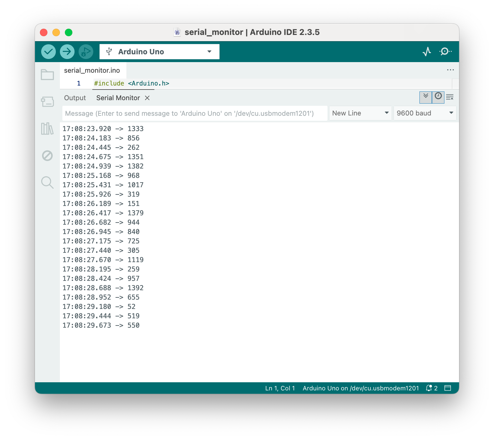

# The Serial Monitor

## Elegoo Lesson 25

[Uno Starter Kit.pdf > Page 169](../../docs/UNO%20Starter%20Kit.pdf)

### Overview

In this lesson, you will build on Lesson 24, adding the facility to control the LEDs from your computer
using the Arduino Serial Monitor. The serial monitor is the 'tether' between the computer and your UNO.

It lets you send and receive text messages, handy for debugging and also controlling the UNO from a keyboard!

For example, you will be able to send commands from your computer to turn on LEDs.

In this lesson, you will use exactly the same parts and a similar breadboard layout as Lesson 24.

So, if you have not already done so, follow [Lesson 24](../24_leds/) now.

### Steps taken

After you have uploaded this sketch onto your UNO, click on the right-most button on the toolbar in the Arduino IDE.

**Components Required:**

* (1) x Elegoo Uno R3
* (1) x 830 tie-points breadboard
* (8) x leds
* (8) x 220 ohm resistors
* (1) x 74hc595 IC
* (14) x M-M wires (Male to Male jumper wires)



This window is called the Serial Monitor and it is part of the Arduino IDE software.

Its job is to allow you to both send messages from your computer to an UNO board (over USB) and also to receive messages from the UNO.

The message “Enter LED Number 0 to 7or 'x' to clear” has been sent by the Arduino. It is telling us what commands we can send to the Arduino: either send the 'x' (to turn all the LEDs off) or the number of the LED you want to turn on (where 0 is the bottom LED, 1 is the next one up, all the way to 7 for the top LED).

Try typing the following commands into the top area of the Serial Monitor that is level with the 'Send' button. Press 'Send', after typing each of these characters: x 0 35 Typing x will have no effect if the LEDs are already all off, but as you enter each number, the corresponding LED should light and you will get a confirmation message from the UNO board. The Serial Monitor will appear as shown below.

Type `x` again and press ‘Send’ to turn off all LEDs.

### Code

After wiring, please open program in the code folder - Lesson 25 The Serial Monitor and click UPLOAD to upload the program.

As you might expect, the sketch is based on the sketch used in Lesson 24. So, we will just cover the new bits here. You will find it useful to refer to the full sketch in your Arduino IDE.

In the 'setup' function, there are three new lines at the end:

```cpp
void setup() {
    pinMode(latchPin, OUTPUT);
    pinMode(dataPin, OUTPUT);
    pinMode(clockPin, OUTPUT);
    updateShiftRegister();
    Serial.begin(9600);
    while (! Serial); // Wait until Serial is ready - Leonardo
    Serial.println("Enter LED Number 0 to 7 or 'x' to clear");
}
```

Firstly, we have the command `Serial.begin(9600)`. This starts serial communication, so that the UNO can send out commands through the USB connection.

The value 9600 is called the **baud rate** of the connection. This is how fast the data is to be sent. You can change this to a higher value, but you will also have to change the Arduino Serial monitor to the same value. We will discuss this later; for now, leave it at 9600.

The line beginning with `while` ensures that there is something at the other end of the USB connection for the Arduino to talk to before it starts sending messages. Otherwise, the message might be sent, but not displayed. This line is actually only necessary if you are using an Arduino Leonardo because the Arduino UNO automatically resets the Arduino board when you open the Serial Monitor, whereas this does not happen with the Leonardo.

The last of the new lines in 'setup' sends out the message that we see at the top of the Serial Monitor.

The 'loop' function is where all the action happens:byte leds = 0;

```cpp
void loop() {
    if (Serial.available()) { 
        char ch = Serial.read();
        if (ch >= '0' && ch <= '7') {
            int led = ch - '0';
            bitSet(leds, led);
            updateShiftRegister();
            Serial.print("Turned on LED ");
            Serial.println(led);
        }
        if (ch == 'x') {
            leds = 0;
            updateShiftRegister();
            Serial.println("Cleared");
        }
    }
}
```

Everything that happens inside the loop is contained within an `if` statement. So unless the call to the built-in Arduino function 'Serial.available()' is 'true' then nothing else will happen.

Serial.available() will return `true` if data has been send to the UNO and is there ready to be processed. Incoming messages are held in what is called a buffer and `Serial.available()` returns true if that buffer is Not empty.

If a message has been received, then it is on to the next line of code:

```cpp
char ch = Serial.read();
```

This reads the next character from the buffer, and removes it from the buffer. It also assigns it to the variable 'ch'. The variable 'ch' is of type 'char' which stands for 'character' and as the name suggests, holds a single character.

If you have followed the instructions in the prompt at the top of the Serial Monitor, then this character will either be a single digit number between 0 and 7 or the letter 'x'.

The 'if' statement on the next line checks to see if it is a single digit by seeing if 'ch' is greater than or equal to the character '0' and less than or equal to the character '7'. It looks a little strange comparing characters in this way, but is perfectly acceptable.

Each character is represented by a unique number, called its ASCII value. This means that when we compare characters using <= and >= it is actually the ASCII values that were being compared.

If the test passes, then we come to the next line:

```cpp
int led = ch – '0';
```

Now we are performing arithmetic on characters! We are subtracting the digit '0' from whatever digit was entered. So, if you typed '0' then '0' – '0' will equal 0. If you typed '7' then '7' – '0' will equal the number 7 because it is actually the ASCII values that are being used in the subtraction.

Since that we know the number of the LED that we want to turn on, we just need to set that bit in the variable 'leds' and update the shift register.

```cpp
bitSet(leds, led);
updateShiftRegister();
```

The next two lines write back a confirmation message to the Serial Monitor.

```cpp
Serial.print("Turned on LED ");
Serial.println(led);
```

The first line uses Serial.print rather than Serial.println. The different between the two is that Serial.print does not start a new line after printing whatever is in its parameter. We use this in the first line, because we are printing the message in two parts. Firstly the general bit: 'Turned on LED ' and then the number of the LED.

The number of the LED is held in an 'int' variable rather than being a text string. Serial.print can take either a text string enclosed in double-quotes, or an 'int' or for that matter pretty much any type of variable.

After the 'if' statement that handles the case, when a single digit has been handled, there is a second 'if' statement that checks to see if 'ch' is the letter 'x'.

```cpp
if (ch == 'x'){
    leds = 0;
    updateShiftRegister(); Serial.println("Cleared");
}
```

If it is, then it clears all the LEDs and sends a confirmation message.

### Result


