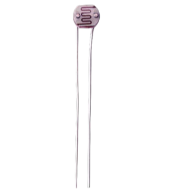
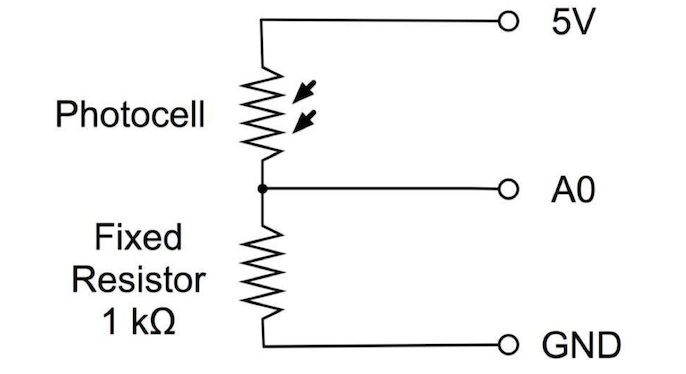
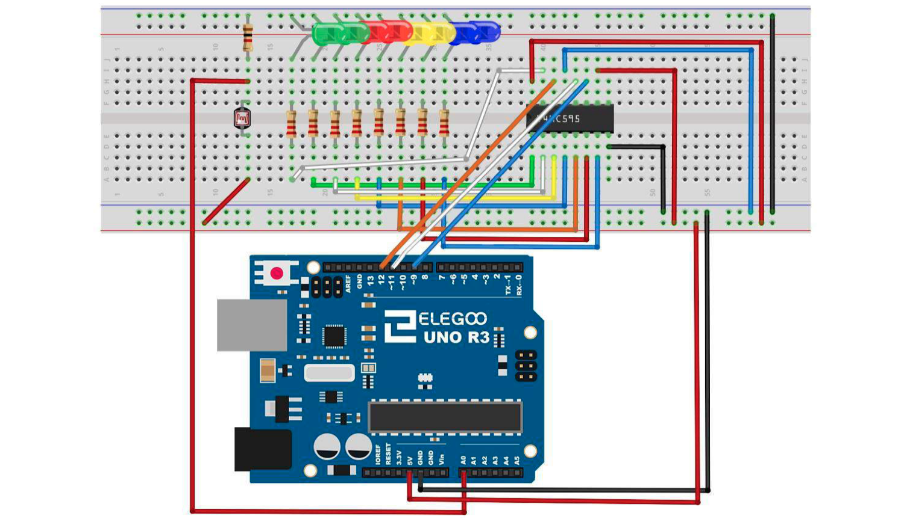

# Photocell

## Elegoo Lesson 26

[Uno Starter Kit.pdf > Page 175](../../docs/UNO%20Starter%20Kit.pdf)

### Overview

Steps taken

In this lesson, you will learn how to measure light intensity using an Analog Input.

You will build on [lesson 24](../24_leds/).

The photocell is at the bottom of the breadboard, where the pot was above.

After you have uploaded this sketch onto your UNO, click on the right-most button on the toolbar in the Arduino IDE.

**Components Required:**

* (1) x Elegoo Uno R3
* (1) x 830 tie-points breadboard
* (8) x leds
* (8) x 220 ohm resistors
* (1) x 1k ohm resistor
* (1) x 74hc595 IC
* (1) x Photoresistor (Photocell)
* (16) x M-M wires (Male to Male jumper wires)



### Component Introduction

The photocell used is of a type called a light dependent resistor, sometimes called an LDR.

As the name suggests, these components act just like a resistor, except that the resistance changes in response to how much light is falling on them.

This one has a resistance of about 50 kΩ in near darkness and 500 Ω in bright light.

To convert this varying value of resistance into something we can measure on an UNO R3 board's analog input, it needs to be converted into a voltage.

The simplest way to do that is to combine it with a fixed resistor.




The resistor and photocell together behave like a pot. When the light is very bright, then the resistance of the photocell is very low compared with the fixed value resistor, and so it is as if the pot were turned to maximum.

When the photocell is in dull light, the resistance becomes greater than the fixed 1 kΩ resistor and it is as if the pot were being turned towards GND.

Load up the sketch given in the next section and try covering the photocell with your finger, and then holding it near a light source.



### Code

After wiring, please open the program in the code folder - **Lesson 26 Photocell** and click UPLOAD to upload the program

The first thing to note is that we have changed the name of the analog pin to be 'lightPin' rather than 'potPin' since we no longer have a pot connected.

The only other substantial change to the sketch is the line that calculates how many of the LEDs to light:

```cpp
int numLEDSLit = reading / 57; // all LEDs lit at 1k
```

This time, we divide the raw reading by 57 rather than 114. In other words, we divide it by half as much as we did with the pot to split it into nine zones, from no LEDs lit to all eight lit.

This extra factor is to account for the fixed 1 kΩ resistor.

This means that when the photocell has a resistance of 1 kΩ (the same as the fixed resistor), the raw reading will be `1023 / 2 = 511`.

This will equate to all the LEDs being lit and then a bit (numLEDSLit) will be 8.

### Result


